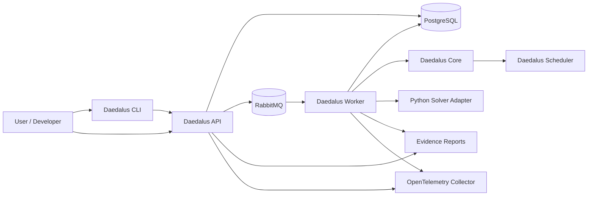
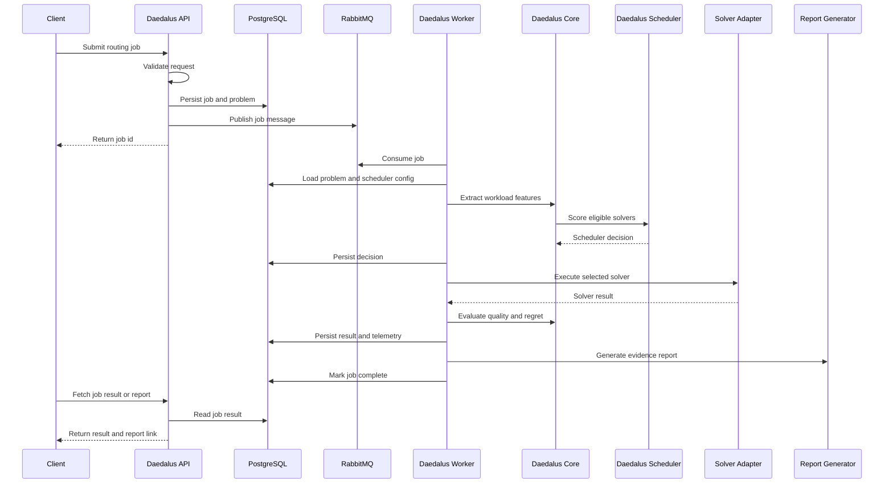
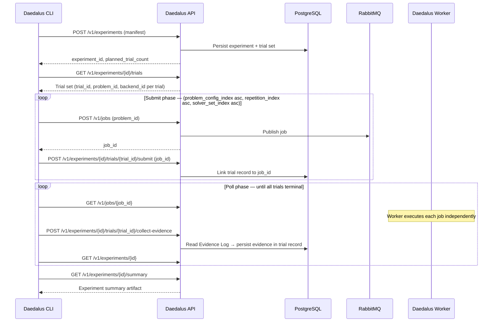
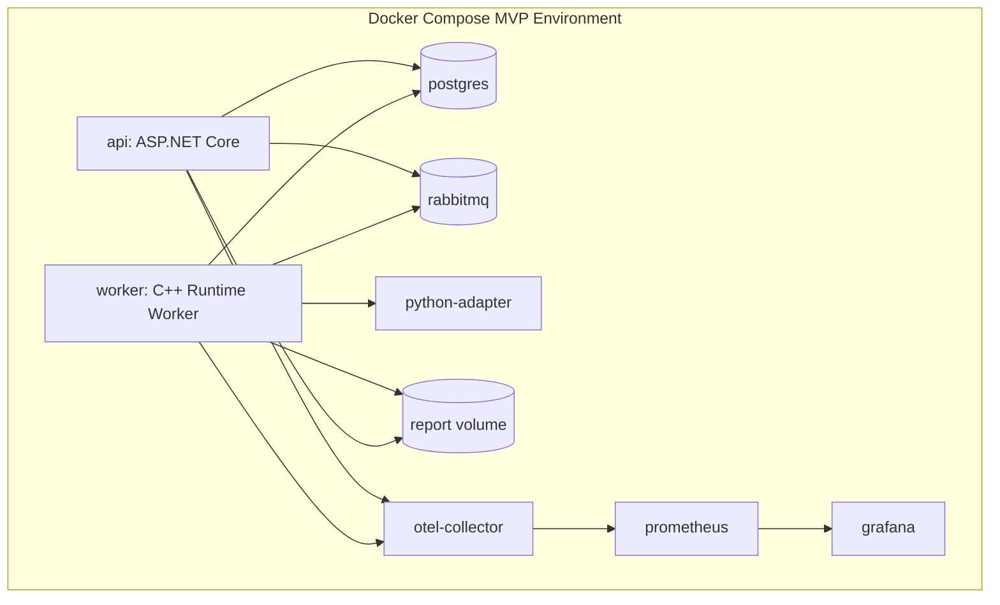

# Architecture

## Project DAEDALUS Architecture

Project DAEDALUS is a production-style hybrid optimization runtime for dynamic fleet-routing workloads.

The architecture separates submission, scheduling, execution, telemetry, persistence, and reporting so that solver backends remain interchangeable and runtime decisions remain explainable.

## Architectural Principles

### Backend Neutrality

Daedalus must not privilege quantum, classical, or AI-based solvers.

Each solver is treated as an execution backend behind a normalized solver contract.

### Evidence Over Hype

Every scheduler decision must produce evidence:

* why the selected solver was chosen
* why other solvers were rejected
* what tradeoffs were predicted
* what actually happened
* whether the decision was good in hindsight

### Production-Style Separation of Concerns

The API submits and observes jobs.

The worker executes jobs.

The runtime core owns domain logic.

The scheduler owns backend selection.

Solver adapters own backend-specific execution.

### Reproducibility

Every generated scenario, solver run, scheduler decision, and report must be reproducible from persisted input, configuration, and random seed.

### Configurable Optimization Objective

The scheduler supports different meanings of "best," including cheapest valid, fastest valid, balanced, best quality, deadline-aware, budget-capped, and experimental execution.

## System Context

The CLI is the primary developer and automation interface. It submits routing jobs and experiment manifests to the API, and acts as the experiment orchestration executor: iterating through trial sets, polling job status endpoints for trial completion, and triggering API-mediated evidence collection. The Worker has no knowledge of experiments and processes each job independently.

## Runtime Execution Flow

## Experiment Execution Flow

The experiment orchestration loop runs in the CLI process (ADR-012 Decision 1). The API is the durable state authority for all experiment state (ADR-012 Decision 2). The Worker processes each trial job without any knowledge of the experiment context (ADR-012 Decision 4).

For all backends in a solver set targeting the same `(problem_config_index, repetition_index)`, the harness shares a single `problem_id` (ADR-012 Decision 3 instance-sharing invariant). This is required for valid cross-solver quality comparisons under SPEC-007 FR-7: `hindsight_quality` is dimensionally comparable only within the same routing problem.

## Major Components

### Daedalus API

The C# ASP.NET Core control plane.

Responsibilities:

* Validate routing job requests
* Persist jobs and problem definitions
* Publish job messages to RabbitMQ
* Expose job status, lifecycle, and report access endpoints
* Expose scheduler configuration endpoints
* Serve report metadata and links
* Persist experiment manifests, trial records, evidence collections, summary artifacts, and benchmark manifests and summaries (ADR-012 Decision 2, SPEC-008, SPEC-020)
* Expose experiment and benchmark endpoints: manifest submission, trial submission linkage, evidence collection trigger, experiment status, trial results, experiment summaries, and benchmark summaries
* Inject W3C TraceContext into RabbitMQ message `application_headers` at job publication (ADR-011)

Non-responsibilities:

* Solver execution
* Heavy optimization logic
* Scheduler scoring
* Workload feature extraction
* Experiment orchestration loop — the CLI is the orchestration executor (ADR-012 Decision 1)
* Writing to Evidence Log artifact tables — the Worker is the sole writer (SPEC-006 FR-1.3)

### Daedalus Worker

The C++ execution service.

Responsibilities:

* Consume queued jobs
* Load routing problems and scheduler configuration
* Invoke Daedalus Core
* Execute solver adapters (C++ in-process or Python adapter via HTTP)
* Enforce execution timeouts externally (HTTP client timeout for Python backends)
* Persist solver runs and telemetry to the Evidence Log
* Generate evidence reports
* Emit OpenTelemetry spans and structured logs
* Extract W3C TraceContext from RabbitMQ message `application_headers` at consumption and establish a navigable trace relationship for `job.consume` (ADR-011)

Non-responsibilities:

* Experiment awareness — the Worker has no knowledge of experiments, trial sets, repetition counts, benchmark identifiers, or experiment lifecycle state (ADR-012 Decision 4). A job submitted by the experiment harness is indistinguishable from any other job submission.
* Writing to experiment tables — the `jobs` table carries no experiment reference field. The experiment-to-job linkage exists exclusively in the experiment-owned trial record, which holds the `job_id` assigned at trial submission (ADR-012 Decision 4).

### Daedalus Core

The C++ domain runtime.

Responsibilities:

* Canonical routing problem model
* Workload feature extraction
* Solver eligibility checks
* Scheduler decision support
* Classical baseline solvers
* Result quality evaluation
* Regret calculation

### Daedalus Scheduler

The policy engine responsible for backend selection.

Responsibilities:

* Evaluate solver eligibility
* Apply hard limits
* Score candidate solvers
* Select a solver
* Reject unsuitable solvers with reasons
* Persist explainable decisions

### Daedalus CLI

The developer-facing and automation-facing interface for Project DAEDALUS (SPEC-016). The CLI is implemented in C++ to allow direct reuse of the routing problem model, the synthetic workload generator, and the ADR-010 reproducibility implementation.

Responsibilities:

* Submit routing problems and jobs to the API
* Drive the synthetic workload generator (SPEC-002, embedded as a library in the CLI binary)
* Retrieve job status, reports, and scheduler configuration
* Act as the experiment orchestration executor (ADR-012 Decision 1):
  * Submit experiment and benchmark manifests to the API
  * Retrieve the planned trial set
  * Submit each trial as a job in ascending `(problem_config_index, repetition_index, solver_set_index)` order
  * Poll API job status endpoints for trial completion
  * Trigger API-mediated evidence collection per terminal trial
  * Retrieve and write experiment summaries and benchmark summaries
* Emit structured JSON debug log events under `DAEDALUS_LOG=debug` (not OTel spans)

Non-responsibilities:

* Direct PostgreSQL access — all interaction is through the Daedalus API
* Experiment state storage — the API is the durable state authority; local result files are convenience outputs
* Automatic experiment resumption after CLI interruption — deferred post-MVP (ADR-012)
* OTel span emission

### Python Solver Adapter

The bridge to Python-native optimization ecosystems (SPEC-017, ADR-005).

Responsibilities:

* Receive SolverRequest JSON from the Worker via `POST /v1/solve`
* Route requests to the appropriate registered Python backend by `backend_id`
* Self-terminate the active solver before `execution_timeout_ms` expires
* Return SolverResponse JSON (HTTP 200) for every produced response regardless of outcome
* Handle client disconnect — in-execution cancellation via TCP connection abort
* Respond to `GET /health` for liveness and readiness checks
* Manage Python environment and dependencies

**Transport contract:** JSON over HTTP within the Docker Compose internal network (ADR-005, SPEC-017). The Worker dispatches each Python-backend invocation as an HTTP POST carrying a SolverRequest and receives a SolverResponse. HTTP non-200 signals adapter-level failure; the Worker constructs a Timeout or Failed SolverResponse on client timeout or non-200. The adapter enforces execution timeouts by self-terminating the active solver before the deadline. Wire format details are defined by SPEC-017.

Non-responsibilities:

* Execution seed derivation — the Worker derives the seed per ADR-010 Decision 4; the adapter forwards it unchanged in the SolverRequest
* OTel span emission
* Launching as a subprocess of the Worker — the adapter is a long-running container process, not a Worker child process
* Evidence persistence, quality evaluation, or report generation

Python is an adapter, not the center of the runtime. Individual Python backend specifications (SPEC-018 for QAOA local simulation, SPEC-019 for quantum hardware) are children of SPEC-017.

### PostgreSQL

Single PostgreSQL instance (ADR-004). The authoritative durable state store for all components.

Two table groups share the instance.

**Job execution tables** are written by the Worker and API. They persist routing problem definitions, scheduler configurations, job lifecycle state, scheduler decisions (including workload feature snapshots), solver outcomes, quality evaluations, and evidence report references. Write ownership boundaries are defined by SPEC-006 and SPEC-012.

**Experiment and benchmark tables** are written exclusively by the API. They persist experiment manifests, benchmark manifests, per-trial records (including the job_id linkage), collected evidence per trial, and computed summary artifacts. The Worker does not access these tables (ADR-012 Decision 4). Schema is defined by SPEC-012.

Backend capability profiles are not stored in PostgreSQL. Workload feature snapshots are embedded in scheduler decision records, not in a separate table. Physical schema, column types, and write ownership rules are defined by SPEC-012.

### RabbitMQ

Asynchronous execution boundary between API and Worker (ADR-003).

Queues:

* `routing-jobs` — job dispatch to Worker
* `routing-jobs-dead-letter` — undeliverable job messages

W3C TraceContext (`traceparent`, optionally `tracestate`) is carried in AMQP message `application_headers` from the API to the Worker (ADR-011). The message payload fields (`job_id`, `problem_id`, `scheduler_config_id`) are unchanged.

### Observability

The MVP includes:

* OpenTelemetry Collector
* Structured JSON logs
* Trace correlation IDs
* Prometheus
* Grafana

**Required OpenTelemetry spans:**

| Span | Owner | Notes |
|---|---|---|
| `job.submit` | API | Covers request receipt through HTTP 202 |
| `job.consume` | Worker | Root of Worker trace; linked to `job.submit` via W3C TraceContext in AMQP `application_headers` (ADR-011) |
| `problem.load` | Worker | |
| `features.extract` | Core | In-process child of `job.consume` |
| `scheduler.score_solvers` | Core / Scheduler | In-process child of `job.consume` |
| `solver.execute` | Worker | Covers solver adapter dispatch including HTTP round-trip for Python backends |
| `result.evaluate` | Worker | |
| `report.generate` | Worker | |
| `job.complete` | Worker | |

**Trace context propagation:** The API injects W3C TraceContext into AMQP message `application_headers` at job publication. The Worker extracts this context at message consumption and establishes a navigable trace relationship between `job.consume` and the `job.submit` context. All subsequent Worker spans are in-process children of `job.consume` (ADR-011).

**CLI observability:** The CLI emits structured JSON debug log events on stderr under `DAEDALUS_LOG=debug`. Experiment-scoped events include `cli.experiment.submit`, `cli.experiment.trial_submit`, `cli.experiment.trial_complete`, `cli.experiment.evidence_collect` (with `evidence_status`), and `cli.experiment.complete`. The CLI does not inject trace headers into outgoing API requests; the API creates a new trace root per request.

## Solver Backend Inventory

All registered backends implement the normalized SolverContract (SPEC-004). C++ backends run in-process within the Worker. Python backends are dispatched via the Python Solver Adapter (SPEC-017) over JSON-over-HTTP.

| Backend | `backend_id` | Language | Category | Reproducibility |
|---|---|---|---|---|
| Nearest Neighbor | `nearest-neighbor` | C++ | `classical_deterministic` | Deterministic |
| Greedy Insertion | `greedy-insertion` | C++ | `classical_deterministic` | Deterministic |
| QUBO Simulated Annealing | `qubo-simulated-annealing` | C++ | `quantum_inspired_stochastic` | Stochastic (reproducible) |
| QAOA — Local Simulator | `qaoa-qiskit` | Python via SPEC-017 | `quantum_inspired_stochastic` | Stochastic (reproducible) |
| QAOA — Quantum Hardware | `qaoa-hardware` | Python via SPEC-017 | `quantum_hardware` | Stochastic (non-reproducible) |

The `qaoa-hardware` backend (SPEC-019) specifies the behavioral contract for hardware-backed QAOA circuit execution against an external cloud quantum provider. Hardware shot outcomes are non-reproducible. Classical pre-processing (parameter initialization, classical optimizer updates) remains seeded and deterministic via PCG64 (ADR-010). See Quantum Execution Boundary below.

## Experiment and Benchmark Execution Architecture

Six architectural decisions (ADR-012) govern how the experiment harness integrates with the existing component model.

**Decision 1 — CLI is the orchestration executor.** The CLI process drives the experiment trial loop: submitting trials as individual jobs, polling job status endpoints for trial completion, and triggering API-mediated evidence collection per terminal trial. No new deployment unit is introduced (Decision 6). The `daedalus experiment run` command is a scoped exception to the CLI's single-invocation posture; it is a long-running process for the duration of the experiment.

**Decision 2 — API is the durable state authority.** All experiment and benchmark state — manifests, trial records, collected evidence, computed statistics, and summary artifact payloads — is persisted by the API. State is recoverable via API queries after any CLI exit. A local result manifest is also written by the CLI, but the API is authoritative.

**Decision 3 — Instance-sharing invariant.** In experiment context, the one-problem-one-job constraint is relaxed. For each `(problem_config_index, repetition_index)` combination, all backends in the solver set share a single `problem_id`. This is required for valid cross-solver quality comparisons. The relaxation is experiment-context only and does not require a schema migration.

**Decision 4 — Worker remains experiment-unaware.** The Worker processes each job as a standard job submission. Job records carry no experiment reference. The experiment-to-job linkage exists exclusively in the API-owned trial record, which holds the `job_id` assigned at trial submission.

**Decision 5 — API-mediated evidence collection.** When the CLI detects a terminal trial job via polling, it triggers evidence collection via the API's collect-evidence endpoint. The API reads from Evidence Log tables and writes the collected evidence to the trial record. This respects the Evidence Log write-ownership boundary: the API writes to experiment trial records, not to Evidence Log tables.

**Decision 6 — No additional deployment unit for MVP.** The experiment harness runs within the existing Docker Compose topology. No dedicated experiment service, background task runner, or experiment coordinator container is introduced.

## Quantum Execution Boundary

ADR-007 defers actual quantum hardware execution beyond the MVP.

**What is in MVP scope:**

* QUBO problem formulation layer and simulated annealing solver (C++, SPEC-015) — a classical stochastic process used as a quantum-inspired execution baseline
* QAOA local circuit simulation via Qiskit Aer (Python, SPEC-018) — executes QAOA variational circuits on the local Aer simulator within the Docker Compose environment; offline, reproducible under PCG64 seeding, requires no hardware access or cloud credentials

**What is deferred:**

* IBM Quantum Runtime execution
* QAOA hardware circuit submission (behavioral contract specified in SPEC-019, execution deferred)
* Any cloud quantum backend integration requiring external credentials or network access

SPEC-019 defines the behavioral contract for the `qaoa-hardware` backend, including timeout accounting, cancellation, non-reproducible shot outcomes, and hardware evidence fields. The Scheduler can classify and reject this backend when classical methods satisfy the configured objective — this is the project's thesis artifact. The boundary between SPEC-018 and SPEC-019 is the shot measurement source: local Aer simulator vs. hardware QPU. Behavioral details are defined by SPEC-019.

## Trace Context Propagation

The API and Worker communicate through RabbitMQ. The asynchronous boundary severs in-process OTel context propagation. ADR-011 resolves this with the following mechanism.

**Propagation:** W3C TraceContext (`traceparent`, optionally `tracestate`) is carried in AMQP message `application_headers`. The API injects context at publication to `routing-jobs`. The Worker extracts it at message consumption using OpenTelemetry-compatible propagation facilities and establishes a navigable trace relationship between `job.consume` and the `job.submit` context.

**Trace relationship:** `job.consume` is the root of the Worker trace hierarchy. All subsequent Worker spans (`problem.load`, `solver.execute`, `result.evaluate`, etc.) are in-process children of `job.consume`. Core-emitted spans (`features.extract`, `scheduler.score_solvers`) propagate the in-process context received from the Worker and appear as descendants of `job.consume`.

**Re-delivery:** On message re-delivery, the original `traceparent` travels with the redelivered message. Both the original execution attempt and any re-delivered attempt are linked to the same originating `job.submit` context. The message payload and job record schemas are unchanged; W3C TraceContext travels in AMQP message metadata only.

**CLI:** The CLI does not inject `traceparent` or `tracestate` headers into outgoing API requests. The API creates a new trace root per inbound request.

**Fallback:** If the OpenTelemetry C++ SDK cannot support W3C TraceContext extraction from AMQP `application_headers` through available integration approaches, the designated fallback is to persist the `job.submit` trace context in the PostgreSQL job record, requiring a SPEC-006 revision under ODR-6 (ADR-011 OQ-1).

## Reproducibility Policy

Project DAEDALUS follows the reproducibility requirements established by ADR-010.

- PCG64 governs all approved stochastic processes.
- Worker-derived execution seeds are the authoritative entropy source.
- Python backends consume the `execution_seed` provided by the Worker via the SolverRequest.
- Approved distribution algorithms and seed derivation rules are governed by ADR-010.
- Any change to the PRNG algorithm, seeding procedure, or approved distribution algorithm is a system-level breaking change requiring an ADR-010 update.
- Quantum hardware execution is exempt from reproducibility guarantees because hardware measurement outcomes are inherently non-deterministic.

Detailed reproducibility requirements, approved algorithms, semantic equivalence guarantees, and breaking-change rules are defined by ADR-010.

## MVP Container Topology

The CLI runs on the developer workstation outside the Docker Compose environment, accessing the API through the published port (`http://localhost:5000` by default). The Python Solver Adapter is a long-running container; the Worker dispatches Python-backend invocations to it via HTTP POST to port 8080 of the internal Docker network. The `python-adapter` container is not launched by the Worker; it is started by Docker Compose and runs continuously alongside the other services.

## Governing Specifications

The architecture described in this document is governed by the accepted specifications under `docs/specs/` and the accepted architectural decisions under `docs/adr/`.

As of 2026-06-23:

- 20 specifications accepted.
- 12 architectural decisions accepted.

Detailed behavioral, persistence, API, and implementation requirements are defined by the individual specifications and ADRs. This document provides the architectural view of the system and the relationships between its major components.

## Open Architecture Questions

The following questions are identified but not yet resolved. No question is resolved by this document.

### Implementation Blockers

These questions must be resolved before implementation of the affected component begins.

**SPEC-016 OQ-6: Per-backend job targeting.** `POST /v1/jobs` accepts `problem_id` and `scheduler_config_id` but no `backend_id`. With a single experiment-wide `scheduler_config_id`, the Scheduler selects the backend by policy. There is no current mechanism to guarantee that a trial job is processed by the `backend_id` that trial requires. This blocks correct per-backend attribution in multi-backend experiments and is the most significant unresolved concern for the experiment harness. Resolution requires a SPEC-008 amendment; candidate approaches are listed in SPEC-016 OQ-6.

### MVP-Safe Open Questions

These questions do not block the MVP but must be assessed during implementation planning.

**ADR-011 OQ-1: C++ OpenTelemetry SDK integration for AMQP metadata.** The concrete approach for extracting W3C TraceContext from AMQP `application_headers` in the C++ Worker has not been confirmed. The OTel C++ SDK does not provide a built-in AMQP integration. If no viable carrier implementation exists, the designated fallback is to persist trace context in the PostgreSQL job record (requires a SPEC-006 revision under ODR-6). Tracing is not on the critical execution path; the fallback is viable for MVP.

**SPEC-003 OQ-2: Backend capability profile registration mechanism.** How backend capability profiles enter the Scheduler's runtime registry at startup is not resolved. PostgreSQL is not the registration store. The specific mechanism — configuration file, compiled-in registry, or another approach — is an implementation planning decision and does not affect the behavioral contract.

### Future Capability Dependencies

These questions are out of scope for MVP and do not require resolution before MVP implementation begins.

**SPEC-008 OQ-7: Generated workload set routing problem creation mechanism.** The API mechanism for creating routing problems from a Generated Mode workload set descriptor is not yet defined. The CLI rejects Generated Mode manifests at MVP scope. Resolution is required before Generated Mode experiment execution can be supported.
