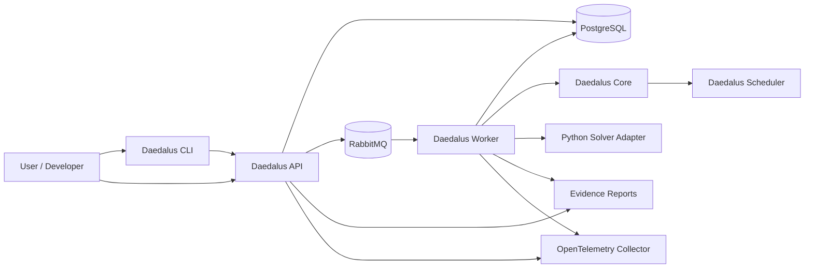
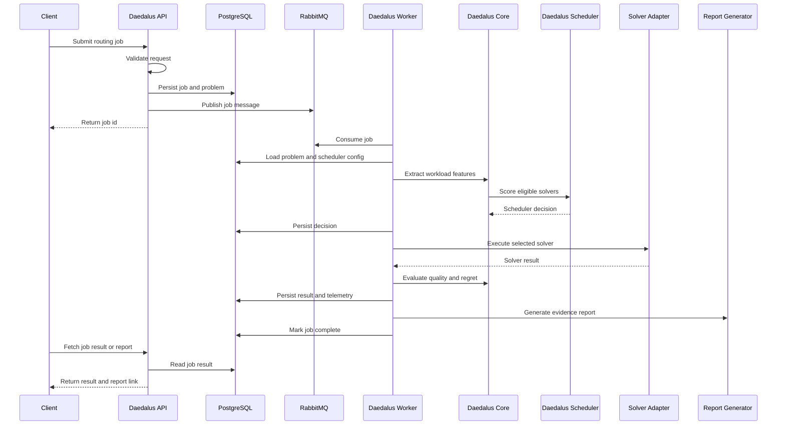
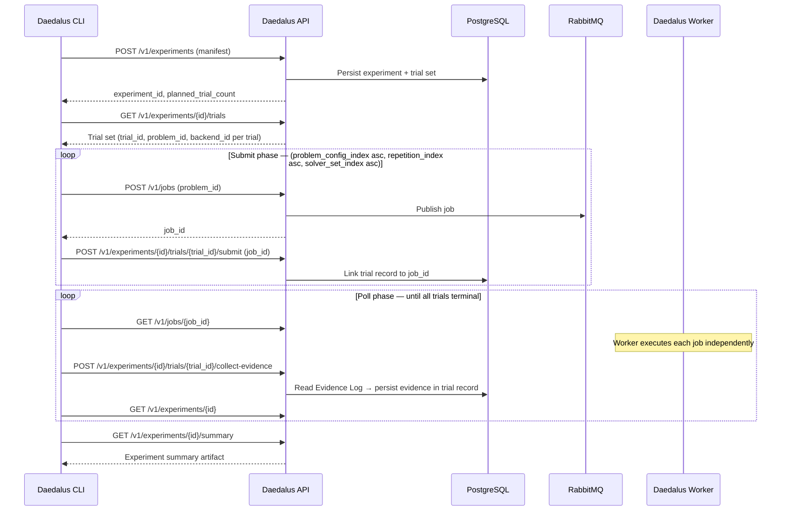
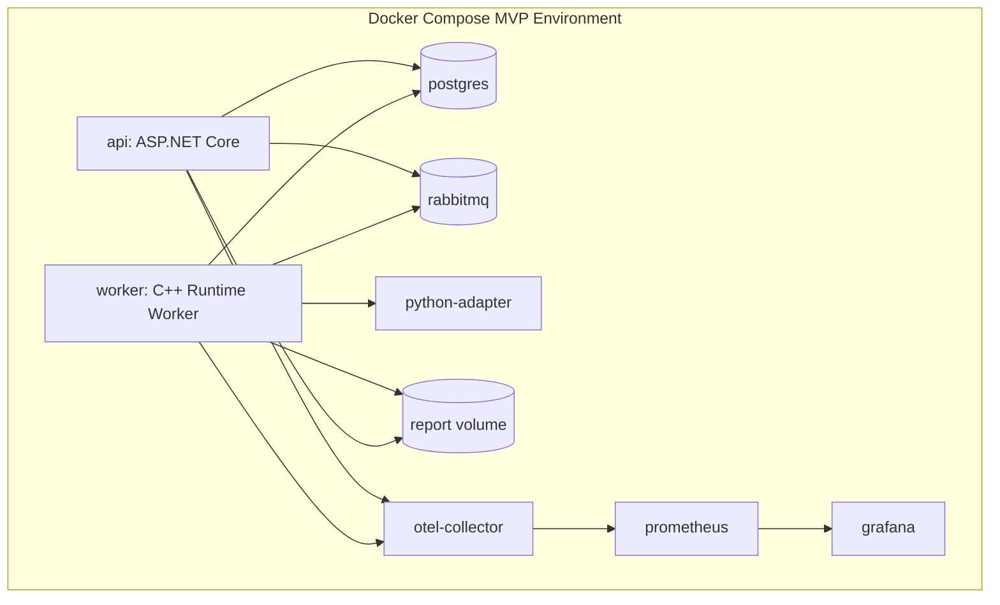

# Architecture

## Project DAEDALUS Architecture

Project DAEDALUS is a production-style hybrid optimization runtime for dynamic fleet-routing workloads.

The architecture separates submission, scheduling, execution, telemetry, persistence, and reporting so that solver backends remain interchangeable and runtime decisions remain explainable.

## Architectural Principles

### Backend Neutrality

Daedalus must not privilege quantum, classical, or AI-based solvers.

Each solver is treated as an execution backend behind a normalized solver contract.

### Evidence Over Hype

Every scheduler decision must produce evidence:

* why the selected solver was chosen
* why other solvers were rejected
* what tradeoffs were predicted
* what actually happened
* whether the decision was good in hindsight

### Production-Style Separation of Concerns

The API submits and observes jobs.

The worker executes jobs.

The runtime core owns domain logic.

The scheduler owns backend selection.

Solver adapters own backend-specific execution.

### Reproducibility

Every generated scenario, solver run, scheduler decision, and report must be reproducible from persisted input, configuration, and random seed.

### Configurable Optimization Objective

The scheduler supports different meanings of "best," including cheapest valid, fastest valid, balanced, best quality, deadline-aware, budget-capped, and experimental execution.

## System Context

The CLI is the primary developer and automation interface. It submits routing jobs and experiment manifests to the API, and acts as the experiment orchestration executor: iterating through trial sets, polling job status endpoints for trial completion, and triggering API-mediated evidence collection. The Worker has no knowledge of experiments and processes each job independently.

## Runtime Execution Flow

## Experiment Execution Flow

The experiment orchestration loop runs in the CLI process (ADR-012 Decision 1). The API is the durable state authority for all experiment state (ADR-012 Decision 2). The Worker processes each trial job without any knowledge of the experiment context (ADR-012 Decision 4).

For all backends in a solver set targeting the same `(problem_config_index, repetition_index)`, the harness shares a single `problem_id` (ADR-012 Decision 3 instance-sharing invariant). This is required for valid cross-solver quality comparisons under SPEC-007 FR-7: `hindsight_quality` is dimensionally comparable only within the same routing problem.

## Major Components

### Daedalus API

The C# ASP.NET Core control plane.

Responsibilities:

* Validate routing job requests
* Persist jobs and problem definitions
* Publish job messages to RabbitMQ
* Expose job status, lifecycle, and report access endpoints
* Expose scheduler configuration endpoints
* Serve report metadata and links
* Persist experiment manifests, trial records, evidence collections, summary artifacts, and benchmark manifests and summaries (ADR-012 Decision 2, SPEC-008, SPEC-020)
* Expose experiment and benchmark endpoints: manifest submission, trial submission linkage, evidence collection trigger, experiment status, trial results, experiment summaries, and benchmark summaries
* Inject W3C TraceContext into RabbitMQ message `application_headers` at job publication (ADR-011)

Non-responsibilities:

* Solver execution
* Heavy optimization logic
* Scheduler scoring
* Workload feature extraction
* Experiment orchestration loop — the CLI is the orchestration executor (ADR-012 Decision 1)
* Writing to Evidence Log artifact tables — the Worker is the sole writer (SPEC-006 FR-1.3)

### Daedalus Worker

The C++ execution service.

Responsibilities:

* Consume queued jobs
* Load routing problems and scheduler configuration
* Invoke Daedalus Core
* Execute solver adapters (C++ in-process or Python adapter via HTTP)
* Enforce execution timeouts externally (HTTP client timeout for Python backends)
* Persist solver runs and telemetry to the Evidence Log
* Generate evidence reports
* Emit OpenTelemetry spans and structured logs
* Extract W3C TraceContext from RabbitMQ message `application_headers` at consumption and establish a navigable trace relationship for `job.consume` (ADR-011)

Non-responsibilities:

* Experiment awareness — the Worker has no knowledge of experiments, trial sets, repetition counts, benchmark identifiers, or experiment lifecycle state (ADR-012 Decision 4). A job submitted by the experiment harness is indistinguishable from any other job submission.
* Writing to experiment tables — the `jobs` table carries no experiment reference field. The experiment-to-job linkage exists exclusively in the experiment-owned trial record, which holds the `job_id` assigned at trial submission (ADR-012 Decision 4).

### Daedalus Core

The C++ domain runtime.

Responsibilities:

* Canonical routing problem model
* Workload feature extraction
* Solver eligibility checks
* Scheduler decision support
* Classical baseline solvers
* Result quality evaluation
* Regret calculation

### Daedalus Scheduler

The policy engine responsible for backend selection.

Responsibilities:

* Evaluate solver eligibility
* Apply hard limits
* Score candidate solvers
* Select a solver
* Reject unsuitable solvers with reasons
* Persist explainable decisions

### Daedalus CLI

The developer-facing and automation-facing interface for Project DAEDALUS (SPEC-016).

Responsibilities:

* Submit routing problems and jobs to the API
* Drive the synthetic workload generator (SPEC-002, embedded as a library in the CLI binary)
* Retrieve job status, reports, and scheduler configuration
* Act as the experiment orchestration executor (ADR-012 Decision 1):
  * Submit experiment and benchmark manifests to the API
  * Retrieve the planned trial set
  * Submit each trial as a job in ascending `(problem_config_index, repetition_index, solver_set_index)` order
  * Poll API job status endpoints for trial completion
  * Trigger API-mediated evidence collection per terminal trial
  * Retrieve and write experiment summaries and benchmark summaries
* Emit structured JSON debug log events under `DAEDALUS_LOG=debug` (not OTel spans)

Non-responsibilities:

* Direct PostgreSQL access — all interaction is through the Daedalus API
* Experiment state storage — the API is the durable state authority; local result files are convenience outputs
* Automatic experiment resumption after CLI interruption — deferred post-MVP (ADR-012)
* OTel span emission

### Python Solver Adapter

The bridge to Python-native optimization ecosystems (SPEC-017, ADR-005).

Responsibilities:

* Receive SolverRequest JSON from the Worker via `POST /v1/solve`
* Route requests to the appropriate registered Python backend by `backend_id`
* Self-terminate the active solver before `execution_timeout_ms` expires
* Return SolverResponse JSON (HTTP 200) for every produced response regardless of outcome
* Handle client disconnect — in-execution cancellation via TCP connection abort
* Respond to `GET /health` for liveness and readiness checks
* Manage Python environment and dependencies

**Transport contract:** JSON over HTTP on port 8080 within the Docker Compose internal network. The Worker dispatches all Python-backend solver invocations as `POST http://{adapter-host}:8080/v1/solve`. HTTP 200 signals that a SolverResponse was produced; HTTP non-200 signals that no SolverResponse was produced (adapter-level failure). The Worker constructs a Timeout or Failed SolverResponse on HTTP client timeout or non-200.

Non-responsibilities:

* Execution seed derivation — the Worker derives the seed per ADR-010 Decision 4; the adapter forwards it unchanged in the SolverRequest
* OTel span emission
* Launching as a subprocess of the Worker — the adapter is a long-running container process, not a Worker child process
* Evidence persistence, quality evaluation, or report generation

Python is an adapter, not the center of the runtime. Individual Python backend specifications (SPEC-018 for QAOA local simulation, SPEC-019 for quantum hardware) are children of SPEC-017.

### PostgreSQL

Single PostgreSQL instance (ADR-004). The authoritative durable state store for all components.

**Job execution tables** — written by Worker and API, governed by SPEC-006 and SPEC-012:

* `routing_problems` — routing problem definitions (immutable after creation)
* `scheduler_configurations` — objective and policy configurations
* `jobs` — job lifecycle records (no experiment reference field — ADR-012 Decision 4)
* `decision_records` — scheduler decisions including workload feature snapshots (JSONB) and candidate scores
* `solver_run_records` — per-execution solver behavior and outcome
* `quality_evaluation_records` — route quality metrics and regret analysis
* `failure_records` — structured failure diagnostics
* `report_metadata_records` — evidence report file path references

**Experiment and benchmark tables** — written exclusively by the API, governed by SPEC-020 and SPEC-012:

* `benchmark_manifests` — benchmark identifiers, research questions, hypotheses
* `experiments` — experiment manifests and lifecycle state
* `experiment_trials` — per-trial records linking `trial_id`, `problem_id`, `backend_id`, `job_id`, and collected evidence
* `experiment_artifacts` — per-experiment summary artifact payloads
* `benchmark_summaries` — cross-experiment aggregate summary artifacts

Backend capability profiles are not stored in PostgreSQL (SPEC-012 FR-2). Workload feature snapshots are embedded in `decision_records` as JSONB, not stored in a separate table (SPEC-012 FR-3). The `uint64` values (`seed`, `execution_seed`, `experiment_seed`) are stored as `bigint` using two's complement encoding (SPEC-012 FR-4.3).

### RabbitMQ

Asynchronous execution boundary between API and Worker (ADR-003).

Queues:

* `routing-jobs` — job dispatch to Worker
* `routing-jobs-dead-letter` — undeliverable job messages

W3C TraceContext (`traceparent`, optionally `tracestate`) is carried in AMQP message `application_headers` from the API to the Worker (ADR-011). The message payload fields (`job_id`, `problem_id`, `scheduler_config_id`) are unchanged.

### Observability

The MVP includes:

* OpenTelemetry Collector
* Structured JSON logs
* Trace correlation IDs
* Prometheus
* Grafana

**Required OpenTelemetry spans:**

| Span | Owner | Notes |
|---|---|---|
| `job.submit` | API | Covers request receipt through HTTP 202 |
| `job.consume` | Worker | Root of Worker trace; linked to `job.submit` via W3C TraceContext in AMQP `application_headers` (ADR-011) |
| `problem.load` | Worker | |
| `features.extract` | Core | In-process child of `job.consume` |
| `scheduler.score_solvers` | Core / Scheduler | In-process child of `job.consume` |
| `solver.execute` | Worker | Covers solver adapter dispatch including HTTP round-trip for Python backends |
| `result.evaluate` | Worker | |
| `report.generate` | Worker | |
| `job.complete` | Worker | |

**Trace context propagation:** The API injects W3C TraceContext into AMQP message `application_headers` at job publication. The Worker extracts this context at message consumption and establishes a navigable trace relationship between `job.consume` and the `job.submit` context. All subsequent Worker spans are in-process children of `job.consume` (ADR-011).

**CLI observability:** The CLI emits structured JSON debug log events on stderr under `DAEDALUS_LOG=debug`. Experiment-scoped events include `cli.experiment.submit`, `cli.experiment.trial_submit`, `cli.experiment.trial_complete`, `cli.experiment.evidence_collect` (with `evidence_status`), and `cli.experiment.complete`. The CLI does not inject trace headers into outgoing API requests; the API creates a new trace root per request.

## Solver Backend Inventory

All registered backends implement the normalized SolverContract (SPEC-004). C++ backends run in-process within the Worker. Python backends are dispatched via the Python Solver Adapter (SPEC-017) over JSON-over-HTTP.

| Backend | `backend_id` | Language | Category | Reproducibility |
|---|---|---|---|---|
| Nearest Neighbor | `nearest-neighbor` | C++ | `classical_deterministic` | Deterministic |
| Greedy Insertion | `greedy-insertion` | C++ | `classical_deterministic` | Deterministic |
| QUBO Simulated Annealing | `qubo-simulated-annealing` | C++ | `quantum_inspired_stochastic` | Stochastic (reproducible) |
| QAOA — Local Simulator | `qaoa-qiskit` | Python via SPEC-017 | `quantum_inspired_stochastic` | Stochastic (reproducible) |
| QAOA — Quantum Hardware | `qaoa-hardware` | Python via SPEC-017 | `quantum_hardware` | Stochastic (non-reproducible) |

The `qaoa-hardware` backend (SPEC-019) specifies the behavioral contract for hardware-backed QAOA circuit execution against an external cloud quantum provider. Hardware shot outcomes are non-reproducible. Classical pre-processing (parameter initialization, classical optimizer updates) remains seeded and deterministic via PCG64 (ADR-010). See Quantum Execution Boundary below.

## Experiment and Benchmark Execution Architecture

Six architectural decisions (ADR-012) govern how the experiment harness integrates with the existing component model.

**Decision 1 — CLI is the orchestration executor.** The CLI process drives the experiment trial loop: submitting trials as individual jobs, polling job status endpoints for trial completion, and triggering API-mediated evidence collection per terminal trial. No new deployment unit is introduced (Decision 6). The `daedalus experiment run` command is a scoped exception to the CLI's single-invocation posture; it is a long-running process for the duration of the experiment.

**Decision 2 — API is the durable state authority.** All experiment and benchmark state — manifests, trial records, collected evidence, computed statistics, and summary artifact payloads — is persisted by the API. This supersedes the pre-SPEC-020 model (SPEC-016 OQ-3) in which only a local result file was produced. State is recoverable via API queries after any CLI exit.

**Decision 3 — Instance-sharing invariant.** In experiment context, the one-problem-one-job constraint (SPEC-008 FR-7, SPEC-001 Assumptions) is relaxed. For each `(problem_config_index, repetition_index)` combination, all backends in the solver set share a single `problem_id`. This applies in both Fixed Mode (pre-existing problem IDs) and Generated Mode (harness-generated problem IDs). The relaxation is experiment-context only. No schema migration is required: `jobs.problem_id` carries no UNIQUE constraint (SPEC-012 FR-6).

**Decision 4 — Worker remains experiment-unaware.** The Worker processes each job as a standard job submission. No experiment identifier appears in the `jobs` table. The experiment-to-job linkage exists exclusively in the trial record (`experiment_trials` table, API-owned), which holds the `job_id` assigned at trial submission.

**Decision 5 — API-mediated evidence collection.** When the CLI detects a terminal trial job via polling, it calls `POST /v1/experiments/{id}/trials/{trial_id}/collect-evidence`. The API reads from Evidence Log tables (unrestricted reading per SPEC-006 FR-1.3) and writes the collected evidence to the trial record. This complies with SPEC-006 FR-1.3 (Worker is the sole writer of Evidence Log artifact tables) because the API writes to experiment trial records, not to Evidence Log tables.

**Decision 6 — No additional deployment unit for MVP.** The experiment harness runs within the existing Docker Compose topology. No dedicated experiment service, background task runner, or experiment coordinator container is introduced.

## Quantum Execution Boundary

ADR-007 defers actual quantum hardware execution beyond the MVP.

**What is in MVP scope:**

* QUBO problem formulation layer and simulated annealing solver (C++, SPEC-015) — a classical stochastic process used as a quantum-inspired execution baseline
* QAOA local circuit simulation via Qiskit Aer (Python, SPEC-018) — executes QAOA variational circuits on the local Aer simulator within the Docker Compose environment; offline, reproducible under PCG64 seeding, requires no hardware access or cloud credentials

**What is deferred:**

* IBM Quantum Runtime execution
* QAOA hardware circuit submission (behavioral contract specified in SPEC-019, execution deferred)
* Any cloud quantum backend integration requiring external credentials or network access

The `qaoa-hardware` backend specification (SPEC-019) defines the full behavioral contract for hardware-backed QAOA: queue-phase timeout accounting, hardware job cancellation, non-reproducible shot outcomes, calibration failure modes, monetary cost reporting, and the hardware evidence fields required for meaningful scheduler rejection evidence. The Scheduler can classify and reject this backend when classical methods satisfy the configured objective, which is the project's thesis artifact. SPEC-019 inherits the QAOA algorithm and QUBO formulation from SPEC-018; the boundary between the two is the shot measurement source (local simulator vs. hardware QPU).

## Trace Context Propagation

The API and Worker communicate through RabbitMQ. The asynchronous boundary severs in-process OTel context propagation. ADR-011 resolves this with the following mechanism.

**Propagation:** W3C TraceContext (`traceparent`, optionally `tracestate`) is carried in AMQP message `application_headers`. The API injects context at publication to `routing-jobs`. The Worker extracts it at message consumption using OpenTelemetry-compatible propagation facilities and establishes a navigable trace relationship between `job.consume` and the `job.submit` context.

**Trace relationship:** `job.consume` is the root of the Worker trace hierarchy. All subsequent Worker spans (`problem.load`, `solver.execute`, `result.evaluate`, etc.) are in-process children of `job.consume`. Core-emitted spans (`features.extract`, `scheduler.score_solvers`) propagate the in-process context received from the Worker and appear as descendants of `job.consume`.

**No schema changes:** The message payload schema (`job_id`, `problem_id`, `scheduler_config_id`) is unchanged. The job record schema is unchanged. AMQP `application_headers` are message metadata, outside the payload schema boundary defined by SPEC-008 FR-5 and SPEC-005 FR-3.

**Re-delivery:** On message re-delivery (SPEC-005 FR-14), the original `traceparent` travels with the redelivered message. Both the original execution attempt and any re-delivered attempt are linked to the same originating `job.submit` context.

**CLI:** The CLI does not inject `traceparent` or `tracestate` headers into outgoing API requests. The API creates a new trace root per inbound request.

**Fallback:** If the OpenTelemetry C++ SDK cannot support W3C TraceContext extraction from AMQP `application_headers` through available integration approaches, the designated fallback is to persist the `job.submit` trace context in the PostgreSQL job record, requiring a SPEC-006 revision under ODR-6 (ADR-011 OQ-1).

## Reproducibility Policy

ADR-010 establishes the reproducibility policy governing all stochastic computation in Project DAEDALUS.

**PRNG algorithm:** PCG64 (Permuted Congruential Generator). Platform-independent output sequence on conforming C++17 toolchains using only 64-bit and 128-bit integer arithmetic. Seeded with the problem seed (SPEC-001 FR-6) as the initial state; the per-component stream constant (PCG64 increment) is fixed at specification acceptance and frozen as a breaking-change boundary.

**Python backends:** PCG64 is realized in Python via `numpy.random.SeedSequence(execution_seed, spawn_key=(BACKEND_SPAWN_KEY,))`. Each Python backend specification declares a unique, frozen `BACKEND_SPAWN_KEY`. The Worker-derived `execution_seed` is the exclusive entropy source; `routing_problem.seed` must not be used as PRNG entropy in Python backends (SPEC-017 FR-9).

**Distribution sampling:** Box-Muller transform for normal distributions; bias-free bounded integer algorithms (not `std::uniform_int_distribution`, which is implementation-defined); portable uniform-float conversion (`u = (v >> 11) × (1.0 / (1ULL << 53))`). All approved algorithms are frozen.

**Reproducibility scope:** Semantic equivalence across conforming C++17 toolchains on IEEE 754 double precision platforms. PCG64 integer sequences are bitwise identical across platforms; transcendental-derived floating-point values are semantically equivalent within IEEE 754 (not required bitwise identical).

**Breaking changes:** Any change to the PRNG algorithm, seeding procedure, approved distribution algorithm, uniform-float formula, or component stream constant is a system-level breaking change requiring an ADR-010 update and version-boundary documentation in all affected specifications.

**Exception:** The `qaoa-hardware` backend (SPEC-019, category `quantum_hardware`) is non-reproducible by nature. Hardware shot outcomes depend on QPU state and are not governed by the PCG64 reproducibility invariant. Classical pre-processing for this backend remains seeded and deterministic.

## MVP Container Topology

The CLI runs on the developer workstation outside the Docker Compose environment, accessing the API through the published port (`http://localhost:5000` by default). The Python Solver Adapter is a long-running container; the Worker dispatches Python-backend invocations to it via HTTP POST to port 8080 of the internal Docker network. The `python-adapter` container is not launched by the Worker; it is started by Docker Compose and runs continuously alongside the other services.

## Accepted Specifications

All twenty specifications are Accepted.

| Spec | Title |
|---|---|
| SPEC-001 | Routing Problem Model |
| SPEC-002 | Synthetic Workload Generator |
| SPEC-003 | Scheduler Objectives and Policy Engine |
| SPEC-004 | Solver Contract |
| SPEC-005 | Worker Execution Lifecycle |
| SPEC-006 | Evidence Log |
| SPEC-007 | Core Quality Evaluation |
| SPEC-008 | API / Control Plane |
| SPEC-009 | Report Generator |
| SPEC-010 | Core Feature Extraction |
| SPEC-011 | Backend Solver Specifications Framework |
| SPEC-012 | Persistence Schema |
| SPEC-013 | Nearest Neighbor Solver |
| SPEC-014 | Greedy Insertion Solver |
| SPEC-015 | QUBO Simulated Annealing Solver |
| SPEC-016 | Daedalus CLI |
| SPEC-017 | Python Solver Adapter |
| SPEC-018 | QAOA Solver Backend (Local Simulator) |
| SPEC-019 | Quantum Hardware Solver Backend |
| SPEC-020 | Benchmark and Experiment Harness |

## Accepted Architectural Decisions

All twelve ADRs are Accepted.

| ADR | Decision | Key Outcome |
|---|---|---|
| ADR-001 | C++ Runtime Language | C++ for Worker and Core |
| ADR-002 | C# ASP.NET Core Control Plane | C# for the API |
| ADR-003 | RabbitMQ Execution Boundary | RabbitMQ as the async job queue; `routing-jobs` and dead-letter queues |
| ADR-004 | PostgreSQL Persistence | Single PostgreSQL instance; no ORM; migration tooling deferred |
| ADR-005 | Python Solver Adapter Role and Contract | Python confined to adapter container; JSON over HTTP transport resolved by SPEC-017 |
| ADR-006 | Observability Stack | OpenTelemetry + Prometheus + Grafana; C++ SDK maturity noted as an accepted risk |
| ADR-007 | Quantum Hardware Deferral | Hardware execution deferred; Qiskit Aer local simulation in MVP via SPEC-018 |
| ADR-008 | Solver Contract and Backend Neutrality | Normalized SolverContract (SPEC-004) across all backends; no privileged solver categories |
| ADR-009 | Domain Validation Authority | API and Core own domain validation; the CLI defers all domain validation to the API |
| ADR-010 | Deterministic Randomness and Reproducibility | PCG64; semantic equivalence scope; Box-Muller; breaking-change governance |
| ADR-011 | Trace Context Propagation | W3C TraceContext in AMQP `application_headers`; no payload or schema changes |
| ADR-012 | Experiment Execution Architecture | CLI orchestrates; API persists; Worker experiment-unaware; instance-sharing invariant; API-mediated evidence collection; no new deployment unit |

## Open Architecture Questions

The following questions are identified but not yet resolved.

**ADR-011 OQ-1: C++ OpenTelemetry SDK integration for AMQP metadata.** The concrete approach for extracting W3C TraceContext from AMQP `application_headers` in the C++ Worker has not been confirmed. The OpenTelemetry C++ SDK does not provide a built-in AMQP integration. The specific carrier implementation must be assessed during Worker implementation planning. If no viable approach exists, the fallback is to persist trace context in the PostgreSQL job record, requiring a SPEC-006 amendment under ODR-6.

**SPEC-008 OQ-7: Generated workload set routing problem creation mechanism.** The API mechanism for creating routing problems from a generated workload set descriptor (SPEC-020 Generated Mode) is not yet defined. The CLI rejects Generated Mode experiment manifests at MVP scope. SPEC-016 OQ-5 tracks this as a CLI-side dependency on the SPEC-008 resolution.

**SPEC-016 OQ-6: Per-backend job targeting.** `POST /v1/jobs` (SPEC-008 FR-2) accepts `problem_id` and `scheduler_config_id` but no `backend_id`. With a single experiment-wide `scheduler_config_id`, the Scheduler selects the backend by policy. There is no current mechanism to guarantee that a trial job is processed by the specific `backend_id` that trial requires. This blocks correct per-backend attribution in multi-backend experiments. Resolution requires a SPEC-008 amendment (candidate resolutions are listed in SPEC-016 OQ-6).

**SPEC-003 OQ-2: Backend capability profile registration mechanism.** How backend capability profiles enter the Scheduler's runtime registry at startup is not resolved. PostgreSQL is not the registration store (SPEC-012 FR-2 determination). The specific mechanism — configuration file, compiled-in registry, or another approach — is an implementation planning decision.

**SPEC-016 OQ-2: CLI implementation language.** The implementation language for the Daedalus CLI is a Project Owner decision. The CLI embeds the SPEC-002 synthetic workload generator; if implemented in C++, the generator library is shared directly with Core. If implemented in another language, the generator requires independent reimplementation with the same PCG64 and distribution algorithm guarantees (ADR-010). This must be resolved before CLI implementation begins.
