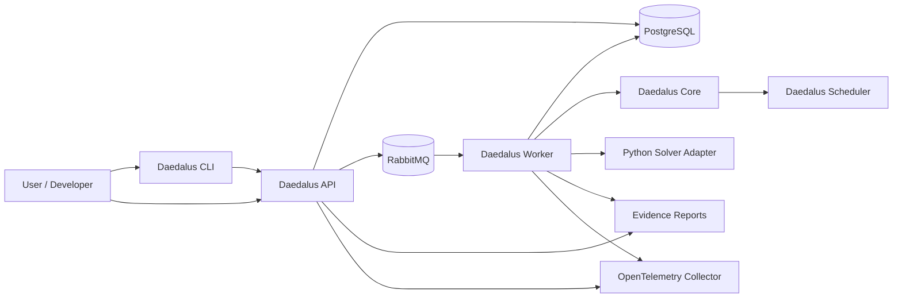
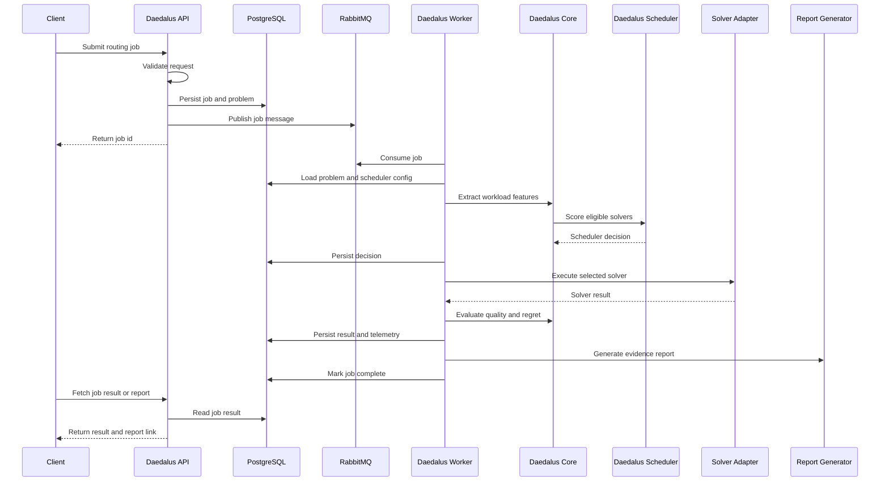
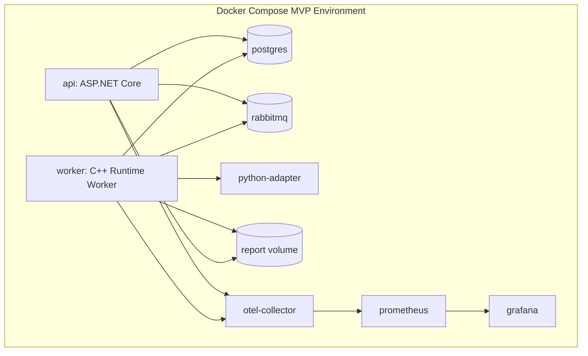

# Architecture

## Project DAEDALUS Architecture

Project DAEDALUS is a production-style hybrid optimization runtime for dynamic fleet-routing workloads.

The architecture separates submission, scheduling, execution, telemetry, persistence, and reporting so that solver backends remain interchangeable and runtime decisions remain explainable.

## Architectural Principles

### Backend Neutrality

Daedalus must not privilege quantum, classical, or AI-based solvers.

Each solver is treated as an execution backend behind a normalized solver contract.

### Evidence Over Hype

Every scheduler decision must produce evidence:

* why the selected solver was chosen
* why other solvers were rejected
* what tradeoffs were predicted
* what actually happened
* whether the decision was good in hindsight

### Production-Style Separation of Concerns

The API submits and observes jobs.

The worker executes jobs.

The runtime core owns domain logic.

The scheduler owns backend selection.

Solver adapters own backend-specific execution.

### Reproducibility

Every generated scenario, solver run, scheduler decision, and report must be reproducible from persisted input, configuration, and random seed.

### Configurable Optimization Objective

The scheduler supports different meanings of “best,” including cheapest valid, fastest valid, balanced, best quality, deadline-aware, budget-capped, and experimental execution.

## System Context

## Runtime Execution Flow

## Major Components

### Daedalus API

The C# ASP.NET Core control plane.

Responsibilities:

* validate routing job requests
* persist jobs and problem definitions
* publish job messages
* expose job status endpoints
* expose scheduler configuration endpoints
* serve report metadata and links

Non-responsibilities:

* solver execution
* heavy optimization logic
* scheduler scoring
* workload feature extraction

### Daedalus Worker

The C++ execution service.

Responsibilities:

* consume queued jobs
* load routing problems and scheduler configuration
* invoke Daedalus Core
* execute solver adapters
* enforce timeouts
* persist solver runs and telemetry
* generate reports
* emit traces and structured logs

### Daedalus Core

The C++ domain runtime.

Responsibilities:

* canonical routing problem model
* workload feature extraction
* solver eligibility checks
* scheduler decision support
* classical baseline solvers
* result quality evaluation
* regret calculation

### Daedalus Scheduler

The policy engine responsible for backend selection.

Responsibilities:

* evaluate solver eligibility
* apply hard limits
* score candidate solvers
* select a solver
* reject unsuitable solvers with reasons
* persist explainable decisions

### Python Solver Adapter

The bridge to Python-native optimization ecosystems.

Responsibilities:

* optional Qiskit experiments
* optional AI policy experiments
* optional OR-Tools integration
* JSON or gRPC adapter contract

Constraint:

Python is an adapter, not the center of the runtime.

### PostgreSQL

Durable persistence for:

* jobs
* routing problems
* scheduler configurations
* scheduler decisions
* solver runs
* solver results
* telemetry events
* reports

### RabbitMQ

Asynchronous execution boundary between API and worker.

Initial queues:

* routing-jobs
* routing-jobs-dead-letter

### Observability

The MVP should include:

* OpenTelemetry Collector
* structured JSON logs
* trace correlation IDs
* Prometheus
* Grafana

Required spans:

* job.submit
* job.consume
* problem.load
* features.extract
* scheduler.score_solvers
* solver.execute
* result.evaluate
* report.generate
* job.complete

## MVP Container Topology

## First Features To Specify

1. Routing Problem Model
2. Scheduler Objectives
3. Hybrid Scheduler Policy Engine
4. Evidence Log
5. Runtime Execution Engine

## Open Architecture Decisions

* Runtime core language: C++
* Control plane language: C# ASP.NET Core
* Queue technology: RabbitMQ
* Persistence: PostgreSQL
* Python role: adapter only
* Quantum hardware execution: deferred beyond MVP
