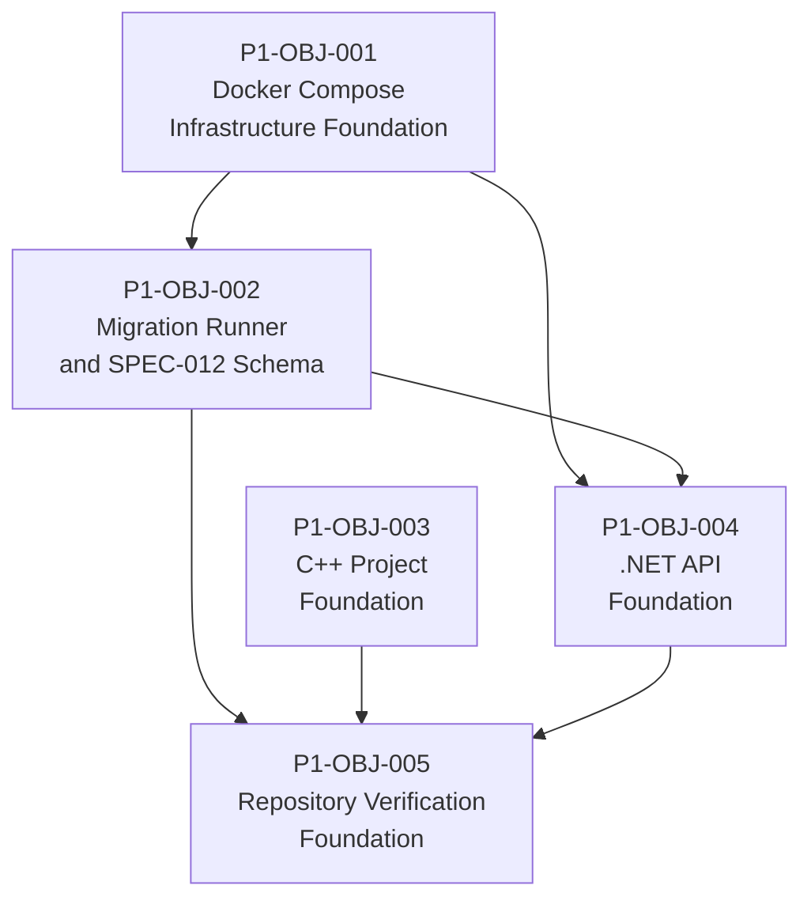

# Phase 1 Implementation Plan — Infrastructure Foundation

**Status:** Ready
**Author:** Darkhorse286
**Created:** 2026-08-01
**Last Updated:** 2026-08-01

---

## 1. Phase Summary

### Objective

Establish the shared infrastructure required for every subsequent implementation phase: the Docker Compose development environment, the PostgreSQL schema and migration tooling, the C++ project foundation, the .NET API foundation, and a minimum set of repository-level verification commands.

### Governing Artifacts

| Artifact | Role |
|---|---|
| ADR-001 (C++ Runtime Language, Accepted) | C++20 and CMake requirements for all C++ components |
| ADR-002 (C# ASP.NET Core, Accepted) | .NET 10 LTS, ASP.NET Core, Npgsql, Dapper for the API |
| ADR-003 (RabbitMQ, Accepted) | Queue topology: routing-jobs, routing-jobs-dead-letter |
| ADR-004 (PostgreSQL, Accepted) | PostgreSQL as the sole durable store; data access libraries |
| ADR-006 (Observability Stack, Accepted) | OTel SDK, Collector, Prometheus, Grafana |
| ADR-010 (Reproducibility, Accepted) | PCG64 scope — excluded from Phase 1; no stochastic behavior |
| ADR-014 (Browser Client Architecture, Accepted) | CORS origin `http://localhost:3000` on the API |
| SPEC-012 (Persistence Schema, Accepted) | Physical DDL for all 13 tables, FK ordering, default config seed |
| Phase 0 Decision 1 | C++20, CMake |
| Phase 0 Decision 2 | .NET 10 LTS, Npgsql, Dapper |
| Phase 0 Decision 3 | DbUp; `infrastructure/postgres/migrations/`; dedicated runner; no startup migrations |
| Phase 0 Decision 4 | Default scheduler config UUID `2f5ce394-c4e4-5324-b842-f1ff47aafc68` |
| Phase 0 Decision 5 | JSON backend profiles in `config/backends/`; schema `config/backend-profile.schema.json` |

### Approved Implementation Decisions

- C++ standard: C++20. Build system: CMake.
- .NET runtime: .NET 10 LTS. Framework: ASP.NET Core. PostgreSQL driver: Npgsql. Query access: Dapper.
- Schema migration tool: DbUp. Migration files: `infrastructure/postgres/migrations/`. Dedicated migration runner container. No startup migrations in the API.
- Default scheduler config UUID: `2f5ce394-c4e4-5324-b842-f1ff47aafc68` (UUIDv5, DNS namespace, name `daedalus/scheduler-config/default/v1`).
- Backend capability profiles: JSON files in `config/backends/`, validated against `config/backend-profile.schema.json`.

### Expected Phase Outcome

At Phase 1 completion:
- `docker compose up` starts all infrastructure services and reaches healthy state
- `docker compose run --rm db-migrate` applies all migrations and seeds the default scheduler configuration
- The .NET API builds, starts, and responds to `GET /health` with a successful PostgreSQL connectivity check
- The C++ CMake project configures, builds, and the test suite runs (zero domain tests at this point)
- Repository-level commands validate JSON schemas, build both language stacks, and apply migrations repeatably

### Phase Exit Criteria

1. All five objectives are complete and their acceptance criteria are satisfied
2. `docker compose config` validates without error
3. All 13 SPEC-012 tables exist after migration with correct schema
4. The default scheduler config is present with UUID `2f5ce394-c4e4-5324-b842-f1ff47aafc68`
5. DbUp journal reflects all applied migrations
6. `GET /health` returns HTTP 200 with a structured response confirming PostgreSQL connectivity
7. C++ build produces no warnings under configured warning flags
8. JSON schema validation passes for all five backend profiles in `config/backends/`
9. Repository verification commands are documented and executable

---

## 2. Dependency Graph

### Prerequisite Ordering



### Dependency Classification

| Objective | Strict Predecessor | Rationale |
|---|---|---|
| P1-OBJ-001 | None | Establishes infrastructure; no application code dependencies |
| P1-OBJ-002 | P1-OBJ-001 | Integration tests require a running PostgreSQL instance |
| P1-OBJ-003 | None | Pure C++ build work; no infrastructure dependency for compilation or unit tests |
| P1-OBJ-004 | P1-OBJ-001, P1-OBJ-002 | P1-OBJ-001 provides PostgreSQL + RabbitMQ; P1-OBJ-002 provides the schema the health check queries |
| P1-OBJ-005 | All prior | Verification commands must reference all completed build artifacts |

### Parallel Tracks

**Track A (sequential):** P1-OBJ-001 → P1-OBJ-002 → P1-OBJ-004

**Track B (independent):** P1-OBJ-003 runs in parallel with Track A from the start. P1-OBJ-003 has no dependency on the infrastructure or migration objectives for compilation and unit tests.

**Track B synchronization point:** P1-OBJ-003 must complete before P1-OBJ-005 begins. P1-OBJ-004 must also complete before P1-OBJ-005 begins.

**P1-OBJ-004 development note:** P1-OBJ-004 development can begin in parallel with P1-OBJ-002. The API project scaffolding, Npgsql/Dapper dependency wiring, OTel baseline, and CORS configuration do not require a running database. However, the integration test that verifies DB connectivity requires both P1-OBJ-001 (PostgreSQL) and P1-OBJ-002 (schema). P1-OBJ-004 is not **complete** until P1-OBJ-002 is done.

### Synchronization Points

1. **P1-OBJ-002 completion gate:** The migration runner must successfully apply all 13 SPEC-012 tables and the default scheduler config seed before P1-OBJ-004 can be declared complete.
2. **All-objectives gate:** P1-OBJ-005 does not start until P1-OBJ-001 through P1-OBJ-004 are all complete.

### Shared File Risks

| File | Touched By | Risk |
|---|---|---|
| `docker-compose.yml` | P1-OBJ-001 (creates); P1-OBJ-004 (adds `db-migrate` run example in README/docs) | Low: P1-OBJ-001 owns the file; P1-OBJ-004 does not modify it |
| `infrastructure/postgres/migrations/` | P1-OBJ-002 exclusively | No conflict risk |
| `infrastructure/postgres/seed/` | P1-OBJ-002 exclusively | No conflict risk |
| `src/api/` | P1-OBJ-004 exclusively | No conflict risk |
| `src/core/`, `src/worker/`, `src/cli/` | P1-OBJ-003 exclusively | No conflict risk |
| `CMakeLists.txt` (root) | P1-OBJ-003 creates | No conflict; other objectives do not touch CMake |
| `Makefile` or `scripts/` | P1-OBJ-005 exclusively | No conflict |

---

## 3. Implementation Objectives

---

### P1-OBJ-001: Docker Compose Infrastructure Foundation

**Objective ID:** P1-OBJ-001

**Title:** Docker Compose Infrastructure Foundation

**Purpose:**
Establish the development environment that all integration tests in Phase 1 depend on. This objective makes the shared infrastructure services (PostgreSQL, RabbitMQ, OTel Collector, Prometheus, Grafana) available, healthy, and consistently configured across all development sessions.

**Governing ADRs:**
- ADR-003: RabbitMQ, queue topology `routing-jobs` and `routing-jobs-dead-letter`
- ADR-004: PostgreSQL as the sole durable store
- ADR-006: OpenTelemetry Collector, Prometheus, Grafana; structured JSON logs to stdout

**Governing Specification Requirements:**
- SPEC-012 FR-14: Schema initialization requires a reachable PostgreSQL instance
- architecture.md Container Topology: PostgreSQL, RabbitMQ, OTel Collector, Prometheus, Grafana nodes

**Scope:**
- `docker-compose.yml`: Define services for `postgres`, `rabbitmq`, `otel-collector`, `prometheus`, `grafana`
- Health checks on all services using native container health check mechanisms
- Named volumes for PostgreSQL data persistence and Grafana data across restarts
- `.env.example` file documenting all required environment variables with safe placeholder values (no secrets committed)
- OTel Collector pipeline configuration file (OTLP receiver → Prometheus exporter, file or debug exporter for structured logs)
- Prometheus configuration file referencing the OTel Collector scrape endpoint
- A `reports` named volume for the evidence report storage mount point (required by the Container Topology; no application code writes to it in Phase 1)

**Explicit Exclusions:**
- API container (`api`), Worker container (`worker`), Python adapter container (`python-adapter`), browser client container (`web-ui`) — none of these have buildable Docker images in Phase 1
- Migration runner container — the runner is added in P1-OBJ-002
- Any Docker Compose override for CI vs. local developer workflow
- Grafana dashboard definitions (ADR-006 explicitly defers these)
- Alert configuration (ADR-006 explicitly defers)
- RabbitMQ dead-letter reprocessing logic (ADR-003 defers to Worker planning)

**Dependencies:**
- None. This objective is the foundation.

**Anticipated Components and Files:**

| File | Purpose |
|---|---|
| `docker-compose.yml` | Service definitions, health checks, volume mounts, port mappings |
| `.env.example` | Template for required environment variables |
| `config/otel-collector.yaml` | OTel Collector pipeline configuration |
| `config/prometheus.yaml` | Prometheus scrape configuration |

**Implementation Deliverables:**
1. `docker-compose.yml` with five infrastructure service definitions
2. Health checks on every service (postgres uses `pg_isready`, rabbitmq uses `rabbitmq-diagnostics ping`, OTel/Prometheus/Grafana use HTTP GET on their health endpoints)
3. `.env.example` with all credentials documented as placeholders
4. OTel Collector configuration file (OTLP/gRPC receiver, Prometheus exporter, logging exporter for stdout)
5. Prometheus scrape configuration referencing the OTel Collector metrics endpoint
6. Named volumes: `postgres-data`, `grafana-data`, `reports`
7. No credentials committed; `.env` in `.gitignore`

**Required Automated Tests:**
- `docker compose config` exits with code 0 and produces no errors
- `docker compose up -d` starts all services and all health checks reach healthy state within timeout
- `docker compose ps` shows all services in running/healthy state
- RabbitMQ management API `GET http://localhost:15672/api/health/checks/alarms` returns healthy (using default management credentials from .env.example)
- PostgreSQL connection test: `pg_isready -h localhost -p 5432` succeeds
- OTel Collector health endpoint responds HTTP 200 (collector health_check extension or equivalent)
- Prometheus `GET http://localhost:9090/-/healthy` responds HTTP 200

**Required Integration Evidence:**
- All five services reach healthy state simultaneously without dependency ordering failures
- `docker compose down -v && docker compose up -d` (full teardown + restart) produces the same healthy state without manual intervention

**Observability Requirements:**
- Grafana is accessible and shows "Grafana is running" at its published host port
- Prometheus is accessible and the OTel Collector scrape target appears in `/targets` with state `UP`
- RabbitMQ management UI is accessible at its published host port

**Port Assignment Note — Mandatory Human Review Point:**
The architecture defines `web-ui` at `http://localhost:3000` (ADR-014 Decision 5). Grafana defaults to internal port 3000. The Docker Compose must map Grafana to a distinct host port (e.g., 3001 or 3030) to avoid conflicting with the `web-ui` container added in a later phase. The implementation agent must choose a host port for Grafana and document it in `.env.example`. This port assignment is a mandatory human-review point before the PR is merged because it affects all developer documentation and the Container Topology diagram.

**Completion Criteria:**
- `docker compose config` succeeds with no errors
- All five services are healthy after `docker compose up -d`
- Full teardown-restart cycle succeeds
- `.env.example` documents all variables required for the stack to start

**Mandatory Human-Review Points:**
1. Grafana host port selection (must not conflict with `web-ui` at :3000)
2. RabbitMQ vhost, username, and queue topology configuration (must match ADR-003: `routing-jobs` and `routing-jobs-dead-letter`)
3. PostgreSQL database name, credentials structure, and the `.env.example` conventions for secrets management

**Escalation Conditions:**
- Any service requires a credential or secret that cannot be represented safely in `.env.example`
- The OTel Collector configuration cannot export metrics to Prometheus using the specified stack without a non-trivial pipeline change
- Docker Compose version or syntax requirements conflict with the host environment

**Expected Pull Request Boundary:**
One PR: `docker-compose.yml`, `.env.example`, OTel and Prometheus config files. No application source code. No migrations.

---

### P1-OBJ-002: Migration Runner and SPEC-012 Schema

**Objective ID:** P1-OBJ-002

**Title:** Migration Runner and SPEC-012 Schema

**Purpose:**
Establish the physical PostgreSQL schema required by every component in Phase 2 and beyond. This objective produces the DbUp migration runner as a standalone .NET 10 console application and applies the complete SPEC-012 schema — all 13 tables in FK dependency order — plus the default scheduler configuration seed. This is the most consequential deliverable in Phase 1: every other component depends on a correct, applied schema.

**Governing ADRs:**
- ADR-004: PostgreSQL; DbUp for schema migration management; versioned SQL files in `infrastructure/postgres/migrations/`

**Governing Specification Requirements:**
- SPEC-012 FR-4 through FR-11: Eight evidence and job execution tables
- SPEC-012 FR-19 through FR-23: Five experiment and benchmark tables
- SPEC-012 FR-14: Table creation order, schema initialization idempotency, DbUp journal, no `capability_profiles` table
- SPEC-012 FR-5.3: Default scheduler config seed, UUIDv5 `2f5ce394-c4e4-5324-b842-f1ff47aafc68`
- SPEC-012 FR-12: Upsert semantics — UNIQUE constraints enabling `job_id`-keyed upsert on all Worker-written tables
- SPEC-012 FR-16.3: No CASCADE DELETE on any FK
- Phase 0 Decision 3: DbUp, `infrastructure/postgres/migrations/`, dedicated runner, startup migration prohibition
- Phase 0 Decision 4: Deterministic UUIDv5 default scheduler config

**Scope:**

**Migration Runner Project:**
- New .NET 10 console application at `src/db-migrate/`
- DbUp NuGet package + Npgsql for PostgreSQL connectivity
- Discovers and applies all `.sql` files in `infrastructure/postgres/migrations/` in filename-sorted order
- Applies seed scripts from `infrastructure/postgres/seed/` after all migration scripts
- Exits with code 0 on success, non-zero on any failure
- Connection string supplied via environment variable (no hardcoded credentials)
- Structured console log output reporting applied and skipped scripts

**SQL Migration Files:**
Create versioned SQL migration files in `infrastructure/postgres/migrations/` following the naming convention `{NNN}_{description}.sql`. Table creation must follow SPEC-012 FR-14.2 FK dependency order:

1. `routing_problems` — no FK dependencies (SPEC-012 FR-4)
2. `scheduler_configs` — no FK dependencies (SPEC-012 FR-5)
3. `benchmark_manifests` — no FK dependencies, text primary key (SPEC-012 FR-19)
4. `jobs` — FKs: `routing_problems`, `scheduler_configs` (SPEC-012 FR-6)
5. `experiments` — FK: `scheduler_configs` (nullable) (SPEC-012 FR-20)
6. `decision_records` — FKs: `jobs`, `routing_problems` (SPEC-012 FR-7)
7. `experiment_trials` — FKs: `experiments`, `routing_problems`, `jobs` (nullable) (SPEC-012 FR-21)
8. `solver_run_records` — FKs: `jobs`, `decision_records`, `routing_problems` (SPEC-012 FR-8)
9. `quality_evaluation_records` — FKs: `jobs`, `decision_records` (SPEC-012 FR-9)
10. `failure_records` — FK: `jobs` (SPEC-012 FR-10)
11. `report_metadata_records` — FK: `jobs` (SPEC-012 FR-11)
12. `experiment_artifacts` — FK: `experiments` (SPEC-012 FR-22)
13. `benchmark_summaries` — no FK dependencies, text primary key (SPEC-012 FR-23)

All `CREATE TABLE` statements use `IF NOT EXISTS`.

**Seed File:**
`infrastructure/postgres/seed/001_default_scheduler_config.sql` — inserts the default `Balanced` scheduler configuration with `scheduler_config_id = '2f5ce394-c4e4-5324-b842-f1ff47aafc68'` using `ON CONFLICT DO NOTHING` semantics. The `mode_parameters` for Balanced mode must encode equal weights per SPEC-003 FR-14.

**Docker Compose Integration:**
Document the invocation `docker compose run --rm db-migrate` in the project README under a "Running Migrations" section. The migration runner does not need a persistent container; it is a one-shot service. A `db-migrate` service definition in `docker-compose.yml` is required so the runner image is built as part of the Compose project.

**Explicit Exclusions:**
- No startup migrations in the API (Phase 0 Decision 3 prohibition — hard constraint)
- No `capability_profiles` table (SPEC-012 FR-2 determination)
- No standalone workload features table (SPEC-012 FR-3 determination)
- No indexing beyond PRIMARY KEY and UNIQUE constraints (SPEC-012 Non-Requirements)
- No table partitioning, replication, or backup configuration
- No application domain logic

**Dependencies:**
- P1-OBJ-001 (Blocking) — PostgreSQL must be available for integration tests

**Anticipated Components and Files:**

| File | Purpose |
|---|---|
| `src/db-migrate/DaedalusMigrate.csproj` | .NET 10 console project |
| `src/db-migrate/Program.cs` | Migration runner entry point; reads connection string; runs DbUp |
| `src/db-migrate/Dockerfile` | Multi-stage build; runtime stage is .NET 10 runtime base image |
| `infrastructure/postgres/migrations/NNN_*.sql` | One or more versioned SQL files covering all 13 tables |
| `infrastructure/postgres/seed/001_default_scheduler_config.sql` | Default scheduler config seed |

**Key Schema Constraints to Verify:**

| Table | Critical Constraint |
|---|---|
| `jobs` | Terminal state CHECK (FR-6.4); `backend_id` text NULL, no FK |
| `decision_records` | UNIQUE(job_id); `selection_mode` DEFAULT 'policy_selected' |
| `solver_run_records` | UNIQUE(job_id); `execution_seed` bigint NOT NULL |
| `quality_evaluation_records` | UNIQUE(job_id) |
| `failure_records` | UNIQUE(job_id); no FK to `decision_records` |
| `report_metadata_records` | UNIQUE(job_id); UNIQUE(report_id) |
| `experiment_trials` | UNIQUE(experiment_id, problem_config_index, backend_id, repetition_index) |
| `experiment_artifacts` | Partial UNIQUE on (experiment_id) WHERE artifact_type = 'ExperimentSummary' |
| No FK | No CASCADE DELETE on any FK relationship (SPEC-012 FR-16.3) |

**Required Automated Tests:**

Unit tests (no database required):
- Migration runner exits with non-zero code when the connection string environment variable is absent
- Migration runner exits with non-zero code when the PostgreSQL connection is refused
- SQL file discovery enumerates all migration files in filename-sorted order

Integration tests (PostgreSQL required; use the P1-OBJ-001 Docker Compose stack):
- Fresh run: all 13 tables created; DbUp journal contains all applied scripts
- Re-run (idempotency): second execution exits 0; DbUp journal unchanged; no duplicate table creation errors
- Default scheduler config present: `SELECT * FROM scheduler_configs WHERE scheduler_config_id = '2f5ce394-c4e4-5324-b842-f1ff47aafc68'` returns one row with `objective_mode = 'Balanced'`
- FK constraint enforcement: insert into `jobs` with non-existent `problem_id` is rejected by PostgreSQL
- No CASCADE DELETE: verify FK constraints on `decision_records` → `jobs` do not use CASCADE
- Partial UNIQUE constraint: two `ExperimentSummary` inserts for the same `experiment_id` on `experiment_artifacts` fails on the second insert

**Required Integration Evidence:**
- `docker compose run --rm db-migrate` applies all scripts successfully against the live PostgreSQL container
- `docker compose run --rm db-migrate` run a second time exits 0 and reports all scripts already applied
- A connected psql session shows all 13 tables present with correct column definitions

**Observability Requirements:**
- Migration runner logs each applied script by filename to stdout
- Migration runner logs "all scripts up to date" on a no-op re-run
- Migration runner logs the failure detail and exits non-zero on any error

**Completion Criteria:**
- All 13 SPEC-012 tables exist after migration with correct column types, NOT NULL constraints, CHECK constraints, UNIQUE constraints, and FK relationships as specified in SPEC-012 FR-4 through FR-23
- No CASCADE DELETE on any FK
- Default scheduler config present with correct UUID and `objective_mode = 'Balanced'`
- DbUp journal table `SchemaVersions` populated with applied migration filenames
- Idempotent re-run verified by integration test

**Mandatory Human-Review Points:**
1. Complete DDL for all 13 tables before first migration application — SPEC-012 is the authoritative reference; any deviation from the specified column types, constraints, or CHECK values requires escalation
2. The `mode_parameters` JSONB value for the default Balanced config — SPEC-003 FR-14 specifies "equal weight allocation" for Balanced mode; the specific numeric weight encoding must be consistent with the Scheduler implementation that will consume it (implementation agent should use equal fractions, e.g., 1/3 each, but this should be confirmed before the PR is merged since the Scheduler implementation does not yet exist)

**Escalation Conditions:**
- Any SPEC-012 table definition is ambiguous or contradictory — stop and report the specific FR and ambiguity; do not resolve silently
- DbUp's default journal table name (`SchemaVersions`) conflicts with any SPEC-012-defined table name — stop and escalate before proceeding
- The UUIDv5 value cannot be independently verified using a standard UUIDv5 implementation against namespace `6ba7b810-9dad-11d1-80b4-00c04fd430c8` and name `daedalus/scheduler-config/default/v1` — stop and report
- Any FK constraint requires CASCADE behavior to satisfy a SPEC-012 requirement — this contradicts FR-16.3 and must be escalated

**Expected Pull Request Boundary:**
One PR: `src/db-migrate/` project, `infrastructure/postgres/migrations/` SQL files, `infrastructure/postgres/seed/` seed file. Updates `docker-compose.yml` to add the `db-migrate` service.

---

### P1-OBJ-003: C++ Project Foundation

**Objective ID:** P1-OBJ-003

**Title:** C++ Project Foundation

**Purpose:**
Establish the CMake project structure that all C++ components (Core, Worker, CLI) will build within. This objective enforces C++20 compliance at the build system level, defines the target boundaries between Core and Worker, establishes the test framework, and sets compiler warning standards. No domain behavior is implemented.

**Governing ADRs:**
- ADR-001: C++20 standard; CMake build system
- ADR-010: Reproducibility policy scope — PCG64 and all stochastic behavior explicitly excluded from this objective

**Governing Specification Requirements:**
- Phase 0 Decision 1: C++20; CMake; all compiler versions in the Docker build environment must support C++20 conformance

**Scope:**
- Root `CMakeLists.txt` with C++20 enforcement: `set(CMAKE_CXX_STANDARD 20)`, `set(CMAKE_CXX_STANDARD_REQUIRED ON)`, `set(CMAKE_CXX_EXTENSIONS OFF)`
- CMake minimum version declaration compatible with the features used
- `CMakePresets.json` (or `CMakeSettings.json`) with at minimum a `debug` and `release` configure preset, each specifying the build directory and generator
- `src/core/CMakeLists.txt` — `daedalus-core` static library target; no source files yet (placeholder target using an empty `.cpp` file or an interface library if no source exists)
- `src/worker/CMakeLists.txt` — `daedalus-worker` executable target; links `daedalus-core`; no domain source files
- `src/cli/CMakeLists.txt` — `daedalus-cli` executable target; links `daedalus-core`; no domain source files
- `tests/CMakeLists.txt` — test targets using the selected test framework
- Compiler warning flags: at minimum `-Wall -Wextra -Wpedantic` for GCC and Clang; `/W4` for MSVC; configured as target compile options on `daedalus-core`
- Test framework integration: one of Catch2 (via FetchContent) or GoogleTest (via FetchContent) — implementation agent's choice; document the rationale
- Dependency management convention: FetchContent for test framework and any future small dependencies; document that external solver libraries should be evaluated for vcpkg or system package approaches before committing to FetchContent for large dependencies
- One C++20 smoke test verifying that at least one C++20 feature compiles and links (e.g., a test using `std::span`, `std::format`, or a concept)

**Explicit Exclusions:**
- No PCG64 implementation (ADR-010; Phase 2+)
- No domain behavior: no routing problem types, no solver interfaces, no scheduler logic
- No libpqxx dependency (Phase 2, Worker DB integration)
- No OpenTelemetry C++ SDK (Phase 2, Worker observability)
- No AMQP client library (Phase 2, Worker queue integration)
- No CLI argument parsing or HTTP client dependencies

**Dependencies:**
- None. This objective is independent of Docker Compose and the .NET stack.

**Anticipated Components and Files:**

| File | Purpose |
|---|---|
| `CMakeLists.txt` | Root CMake; C++20 enforcement; adds subdirectories |
| `CMakePresets.json` | Developer build presets (debug, release) |
| `src/core/CMakeLists.txt` | `daedalus-core` library target |
| `src/core/placeholder.cpp` | Minimal stub to satisfy the static library target until domain code arrives |
| `src/worker/CMakeLists.txt` | `daedalus-worker` executable target |
| `src/cli/CMakeLists.txt` | `daedalus-cli` executable target |
| `tests/CMakeLists.txt` | Test runner target using chosen framework |
| `tests/core/cpp20_smoke_test.cpp` | Verifies C++20 features compile and link |

**Implementation Deliverables:**
1. CMake project that configures without error with GCC 13+ or Clang 16+ targeting C++20
2. All three binary targets (`daedalus-core`, `daedalus-worker`, `daedalus-cli`) build without warnings
3. Test framework available and test suite runs (minimum: C++20 smoke test passes)
4. CMakePresets.json with usable debug and release presets
5. Documented build entry points: configure command, build command, test command

**Required Automated Tests:**
- CMake configure completes without error: `cmake --preset debug` (or equivalent) exits 0
- CMake build completes without warnings under configured flags: `cmake --build --preset debug` exits 0 with empty stderr
- Test suite runs and passes: `ctest --preset debug` (or equivalent) reports all tests passed
- C++20 smoke test: the test uses at least one C++20-only feature (`std::span`, `std::format`, a `concept`, or designated initializers) in a test that passes

**Required Integration Evidence:**
- A fresh clone of the repository, after running only CMake configure and build commands, produces all three targets without errors
- The C++20 smoke test output confirms the C++ standard is 20 and the feature under test behaves correctly

**Observability Requirements:**
- CMake build output is clean (no warnings, no deprecation notices) under the configured warning flags

**Completion Criteria:**
- CMake configure and build succeed without errors or warnings
- C++20 standard is enforced at the project level; a file using C++17-only features that are not in C++20 would be a build error (this is a configuration invariant, not a test)
- Test framework is available, the test runner runs, and the smoke test passes
- CMakePresets.json provides usable developer entry points

**Mandatory Human-Review Points:**
1. Dependency management convention documented in the objective deliverables — specifically the decision on FetchContent vs. system packages for the test framework, and the guidance for future solver library dependencies; this guidance will be inherited by all subsequent C++ objectives

**Escalation Conditions:**
- The selected test framework cannot be integrated via FetchContent in the target Docker Compose build environment — escalate before choosing an alternative to ensure it does not conflict with future library dependencies
- C++20 conformance cannot be enforced at the CMake level for all three target types simultaneously — escalate; do not weaken the standard to C++17

**Expected Pull Request Boundary:**
One PR: CMake root file, CMakePresets.json, three component CMakeLists.txt files, tests directory, smoke test. No domain source code.

---

### P1-OBJ-004: .NET API Foundation

**Objective ID:** P1-OBJ-004

**Title:** .NET API Foundation

**Purpose:**
Establish the ASP.NET Core project structure with all Phase 1 baseline dependencies wired, CORS configured for the browser client origin, and a health endpoint that verifies PostgreSQL connectivity. This is the minimum necessary API scaffold for all subsequent feature implementation objectives to build on.

**Governing ADRs:**
- ADR-002: C# ASP.NET Core; .NET 10 LTS; Npgsql; Dapper
- ADR-004: PostgreSQL; Dapper + Npgsql for .NET API
- ADR-006: OpenTelemetry .NET SDK; structured JSON logs
- ADR-014: CORS required for browser client origin `http://localhost:3000`

**Governing Specification Requirements:**
- Phase 0 Decision 2: .NET 10 LTS; ASP.NET Core; Npgsql; Dapper
- SPEC-012 FR-17.1: Persistence failure log events must include required fields (baseline structured logging must be in place before any persistence code is added)

**Scope:**
- .NET 10 solution file at `src/api/DaedalusApi.sln`
- API project at `src/api/DaedalusApi/DaedalusApi.csproj` targeting `net10.0`
- Test project at `src/api/DaedalusApi.Tests/DaedalusApi.Tests.csproj`
- Required NuGet package references: Npgsql, Dapper, OpenTelemetry (core + ASP.NET Core instrumentation + Npgsql instrumentation), RabbitMQ.Client (dependency declared but not wired to any endpoint)
- ASP.NET Core application startup with:
  - CORS policy permitting origin `http://localhost:3000` with appropriate methods and headers (ADR-014 Decision 5)
  - OpenTelemetry tracing configured for the API service name (`daedalus-api`); exporter targets the OTel Collector OTLP endpoint from `docker-compose.yml`
  - Structured JSON logging using the .NET structured logging infrastructure
  - Npgsql data source registered in DI from environment-supplied connection string
- Health endpoint: `GET /health` returns HTTP 200 with a JSON body; the response body includes at minimum a `status` field and a `database` connectivity indicator derived from a live Npgsql connection check (e.g., `SELECT 1`)
- Connection string and OTel Collector endpoint sourced from environment variables, not appsettings.json hardcoded values

**Explicit Exclusions:**
- No SPEC-008 feature endpoints (no `/v1/jobs`, `/v1/experiments`, `/v1/scheduler-configs` or any other functional endpoint)
- No Dapper queries beyond the health check `SELECT 1` connectivity test
- No RabbitMQ connection or channel setup — the RabbitMQ.Client dependency is declared but not used
- No message publishing
- No request validation beyond what ASP.NET Core provides by default
- No response models beyond the health endpoint response
- No authentication or authorization

**Dependencies:**
- P1-OBJ-001 (Blocking for integration tests) — PostgreSQL and RabbitMQ containers must be running
- P1-OBJ-002 (Blocking for DB health check integration test) — schema must exist for the Npgsql connectivity check to be meaningful

**Development Note:**
The API project scaffolding, NuGet dependency wiring, OTel baseline, and CORS configuration can begin in parallel with P1-OBJ-002. The integration test requiring live DB connectivity cannot be run until P1-OBJ-002 is complete.

**Anticipated Components and Files:**

| File | Purpose |
|---|---|
| `src/api/DaedalusApi.sln` | Solution file |
| `src/api/DaedalusApi/DaedalusApi.csproj` | API project file; .NET 10 target; NuGet references |
| `src/api/DaedalusApi/Program.cs` | App host configuration; DI wiring; middleware pipeline |
| `src/api/DaedalusApi/Endpoints/HealthEndpoint.cs` | Minimal API health endpoint |
| `src/api/DaedalusApi.Tests/DaedalusApi.Tests.csproj` | Test project |

**Implementation Deliverables:**
1. .NET 10 ASP.NET Core application that builds without errors or warnings
2. CORS policy configured for `http://localhost:3000`; tested by asserting the `Access-Control-Allow-Origin` header on OPTIONS preflight
3. OTel SDK configured with the API service name and OTLP exporter endpoint from environment
4. Structured JSON logging active on application startup
5. `GET /health` endpoint returning HTTP 200 with JSON body including DB connectivity status
6. All configuration values sourced from environment variables
7. `dotnet build` succeeds in CI without warnings treated as errors (or with warnings-as-errors enabled and zero warnings)
8. Unit tests for CORS configuration and health endpoint response structure
9. Integration test verifying `GET /health` returns HTTP 200 against a live PostgreSQL connection

**Required Automated Tests:**

Unit tests (no infrastructure required):
- CORS OPTIONS preflight for `http://localhost:3000` returns `Access-Control-Allow-Origin: http://localhost:3000`
- CORS OPTIONS preflight for a non-permitted origin (e.g., `http://evil.example.com`) does not return `Access-Control-Allow-Origin`
- Health endpoint response body contains required fields (`status`, `database`)
- Missing connection string environment variable causes application startup failure (not silent degradation)

Integration tests (PostgreSQL required; run against P1-OBJ-001 + P1-OBJ-002 stack):
- `GET /health` returns HTTP 200 when PostgreSQL is reachable
- Health response body `database` field indicates connectivity success
- `GET /health` returns a non-200 or degraded status when PostgreSQL is unreachable (verify graceful failure, not unhandled exception)

**Required Integration Evidence:**
- `dotnet run` starts the API without errors; `GET /health` returns HTTP 200 against the Docker Compose PostgreSQL
- OTel Collector receives spans from the API on `GET /health` (verify in Prometheus or OTel Collector debug output)
- CORS header present in response to a `GET /health` request with `Origin: http://localhost:3000` header

**Observability Requirements:**
- API startup produces a structured JSON log event at INFO level with the service name
- Each `GET /health` request produces a structured JSON log event
- OTel tracing span created for the health endpoint invocation

**Completion Criteria:**
- `dotnet build` succeeds without errors or warnings
- All unit tests pass
- Integration test `GET /health` returns HTTP 200 with correct response body against live PostgreSQL
- CORS header present for browser client origin
- OTel tracing functional (verifiable via Collector debug output)

**Mandatory Human-Review Points:**
1. CORS policy scope — the policy must permit `http://localhost:3000` specifically; the implementation agent must not configure wildcard CORS (`*`) which would not satisfy the ADR-014 requirement and would create a security concern for any future non-local deployment

**Escalation Conditions:**
- The OpenTelemetry .NET SDK version compatible with .NET 10 does not support a required feature (e.g., Npgsql instrumentation or OTLP gRPC export) — escalate before choosing an alternative
- The Npgsql connectivity check in the health endpoint cannot be implemented without a schema dependency beyond `SELECT 1` — escalate; do not add schema-dependent queries to the health endpoint in Phase 1
- CORS configuration requires modifications to the `docker-compose.yml` that conflict with P1-OBJ-001 decisions — escalate rather than silently modifying infrastructure

**Expected Pull Request Boundary:**
One PR: solution and project files, `Program.cs`, health endpoint, test project, unit tests, integration test. Does not modify `docker-compose.yml`.

---

### P1-OBJ-005: Repository Verification Foundation

**Objective ID:** P1-OBJ-005

**Title:** Repository Verification Foundation

**Purpose:**
Define the minimum set of repository-level commands required to verify the Phase 1 deliverables. These commands serve as the developer entry point and the foundation for any future CI pipeline. The commands must be simple, discoverable, and composable. They must not impose a build orchestration system larger than the verification need.

**Governing ADRs:**
- ADR-006: Observability stack (validate Compose configuration)
- Phase 0 Decision 5: JSON schema validation for backend profiles

**Governing Specification Requirements:**
- Phase 0 Decision 5: All five files in `config/backends/` must validate against `config/backend-profile.schema.json`

**Scope:**
A `Makefile` at the repository root with the following targets (or equivalent shell scripts in `scripts/` if a Makefile is not appropriate for the target developer environment). All targets must be independently executable without depending on targets having run first, except where a strict prerequisite is documented in the target's recipe.

| Target | Command Description |
|---|---|
| `validate-profiles` | Validate all JSON files in `config/backends/` against `config/backend-profile.schema.json` using a JSON Schema validator (e.g., `ajv validate` or equivalent Node.js CLI tool; OR Python `jsonschema` package; the tool choice is implementation agent's decision) |
| `build-dotnet` | `dotnet build src/api/DaedalusApi.sln` |
| `test-dotnet` | `dotnet test src/api/DaedalusApi.sln` |
| `configure-cpp` | `cmake --preset debug` (or equivalent using CMakePresets.json from P1-OBJ-003) |
| `build-cpp` | `cmake --build --preset debug` |
| `test-cpp` | `ctest --preset debug` (or equivalent) |
| `validate-compose` | `docker compose config` |
| `migrate` | `docker compose run --rm db-migrate` |

A `help` target or header comment must document each target's purpose in one line.

**Explicit Exclusions:**
- No CI pipeline files (GitHub Actions, GitLab CI, Jenkins, etc.) — out of scope for Phase 1; this is developer-local verification only
- No test coverage reporting, code generation, linting, or formatting enforcement
- No dependency installation automation (`npm install`, `dotnet restore`) — these are assumed to be developer-run prerequisites
- No parallel build orchestration; targets are independent and run sequentially when invoked manually

**Dependencies:**
- P1-OBJ-001, P1-OBJ-002, P1-OBJ-003, P1-OBJ-004 (all Blocking) — every verification target requires the corresponding component to exist

**Anticipated Components and Files:**

| File | Purpose |
|---|---|
| `Makefile` (or `scripts/validate-profiles.sh`, etc.) | Verification entry points |
| `README.md` (updated) | Developer quick-start section documenting the verification targets |

**Implementation Deliverables:**
1. `Makefile` (or equivalent) with eight targets as specified above
2. `validate-profiles` target successfully validates all five backend JSON files when the backend profile files and schema are present
3. README.md updated with a "Development Commands" section listing each target and its purpose
4. All eight targets execute successfully against the current repository state (with the Docker Compose stack running for `validate-compose` and `migrate`)

**Required Automated Tests:**
- `validate-profiles` exits 0 when run against the current `config/backends/` files
- `validate-profiles` exits non-zero when run against a deliberately invalid JSON file (verify the validator actually checks the schema)
- `validate-compose` exits 0 against the `docker-compose.yml` from P1-OBJ-001
- `build-dotnet` exits 0
- `build-cpp` exits 0

**Required Integration Evidence:**
- A developer following only the README "Development Commands" section, after installing prerequisites, can execute all targets in order and reach a green state on a fresh clone

**Observability Requirements:**
- No specific observability requirements for the verification scripts themselves; they produce exit codes and terminal output

**Completion Criteria:**
- All eight targets are defined and execute without error against the Phase 1 deliverables
- `validate-profiles` actually invokes JSON Schema validation (not a no-op script)
- README developer quick-start section reflects the current state of the commands

**Mandatory Human-Review Points:**
- None specific to this objective; routine documentation and script content.

**Escalation Conditions:**
- The JSON Schema validation tool selected for `validate-profiles` requires a runtime (Node.js, Python) not present in the standard developer setup — escalate rather than adding a silent prerequisite; document it explicitly in the README
- Any verification target fails on the current repository state after Phase 1 objectives are complete — this is a sign of integration failure, not a verification failure, and requires identifying which objective introduced the gap

**Expected Pull Request Boundary:**
One PR: `Makefile` (or scripts), `README.md` update. No source code changes.

---

## 4. Parallelization Plan

### Objectives That May Run Concurrently

| Agent A | Agent B | Safe to Run Simultaneously | Condition |
|---|---|---|---|
| P1-OBJ-001 | P1-OBJ-003 | Yes | No shared files; no dependency |
| P1-OBJ-002 | P1-OBJ-003 | Yes | No shared files; P1-OBJ-003 has no infrastructure dependency |
| P1-OBJ-003 | P1-OBJ-004 (scaffolding only) | Yes | P1-OBJ-004 scaffolding (project files, CORS, OTel wiring) can proceed; integration tests cannot run until P1-OBJ-002 completes |

### Objectives That Must Remain Sequential

| Sequence | Reason |
|---|---|
| P1-OBJ-001 must complete before P1-OBJ-002 begins | P1-OBJ-002 integration tests require a running PostgreSQL |
| P1-OBJ-002 must complete before P1-OBJ-004 is declared done | Health endpoint integration test requires the schema to exist |
| All four prior objectives must complete before P1-OBJ-005 begins | Verification commands reference all prior deliverables |

### Likely Merge-Conflict Areas

| File | Risk | Mitigation |
|---|---|---|
| `docker-compose.yml` | P1-OBJ-001 creates it; P1-OBJ-002 adds `db-migrate` service | P1-OBJ-002 should have a clear handoff: P1-OBJ-001 PR merged first, then P1-OBJ-002 adds `db-migrate` service in its own PR |
| `README.md` | P1-OBJ-002 adds migration section; P1-OBJ-005 adds development commands section | Assign to separate sections; merge in order (P1-OBJ-002 before P1-OBJ-005) |

### Recommended Agent Ownership

| Agent | Objectives | Rationale |
|---|---|---|
| Infrastructure Agent | P1-OBJ-001 | Docker Compose, YAML config; distinct skill set |
| Backend Agent (C#) | P1-OBJ-002, P1-OBJ-004 | Shares .NET 10 toolchain knowledge; migration runner and API are both .NET; sequential to avoid Docker Compose conflicts |
| Backend Agent (C++) | P1-OBJ-003 | Independent track; no shared files with .NET work |
| Integration Agent | P1-OBJ-005 | After all prior PRs are merged; verifies the full system |

**Practical two-agent model:** One agent handles P1-OBJ-001, P1-OBJ-002, and P1-OBJ-004 sequentially (infrastructure then .NET work). A second agent handles P1-OBJ-003 in parallel. P1-OBJ-005 is handed to either agent after both tracks complete.

---

## 5. Phase Verification Strategy

### Build Evidence

| Component | Command | Expected Result |
|---|---|---|
| C++ (all targets) | `cmake --preset debug && cmake --build --preset debug` | 0 warnings, 0 errors |
| .NET API | `dotnet build src/api/DaedalusApi.sln` | 0 warnings, 0 errors |
| .NET migration runner | `dotnet build src/db-migrate/DaedalusMigrate.csproj` | 0 warnings, 0 errors |

### Test Evidence

| Component | Command | Expected Result |
|---|---|---|
| C++ test suite | `ctest --preset debug` | All tests pass; C++20 smoke test is in the passed list |
| .NET unit tests | `dotnet test src/api/DaedalusApi.sln --filter Category!=Integration` | All unit tests pass |
| .NET integration tests | `dotnet test src/api/DaedalusApi.sln --filter Category=Integration` | All integration tests pass (requires running Docker Compose stack) |
| Migration runner unit tests | `dotnet test src/db-migrate/ --filter Category!=Integration` | All unit tests pass |
| Migration runner integration tests | `docker compose run --rm db-migrate` (after clean state) + query verification | All 13 tables present; journal populated |

### Migration Evidence

| Check | Method | Expected Result |
|---|---|---|
| All 13 tables created | `\dt` in psql or information_schema query | 13 tables present |
| Default config present | `SELECT scheduler_config_id, objective_mode FROM scheduler_configs` | One row with `2f5ce394-c4e4-5324-b842-f1ff47aafc68` and `Balanced` |
| DbUp journal populated | `SELECT scriptname FROM "SchemaVersions"` | All migration filenames listed |
| No CASCADE DELETE | `SELECT tc.table_name, cc.confdeltype FROM pg_constraint cc JOIN pg_class tc ON ...` | `confdeltype = 'a'` (no action) for all FKs |
| Idempotent re-run | `docker compose run --rm db-migrate` (second run) | Exit 0; journal unchanged |

### Docker Compose Evidence

| Check | Command | Expected Result |
|---|---|---|
| Config valid | `docker compose config` | Exit 0; no errors |
| All services healthy | `docker compose ps` | All services show `healthy` state |
| RabbitMQ management | `GET http://localhost:15672/api/health/checks/alarms` | HTTP 200 |
| Prometheus reachable | `GET http://localhost:9090/-/healthy` | HTTP 200 |
| Grafana reachable | `GET http://localhost:{grafana-port}/api/health` | HTTP 200 |

### Schema Evidence

| Check | Method | Expected Result |
|---|---|---|
| `execution_seed` single-location | `SELECT column_name, table_name FROM information_schema.columns WHERE column_name = 'execution_seed'` | Only `solver_run_records` |
| UNIQUE constraints present | `information_schema.table_constraints` query | `UNIQUE (job_id)` on five Worker-written tables; `UNIQUE (report_id)` on `report_metadata_records`; `UNIQUE (experiment_id, problem_config_index, backend_id, repetition_index)` on `experiment_trials` |

### Configuration Validation

| Check | Command | Expected Result |
|---|---|---|
| JSON profiles valid | `make validate-profiles` | Exit 0; all five profiles validate |
| Compose valid | `make validate-compose` | Exit 0 |
| CORS response | `curl -H "Origin: http://localhost:3000" -I http://localhost:5000/health` | `Access-Control-Allow-Origin: http://localhost:3000` in response |

### Unresolved Risks at Phase 1 Exit

| Risk | Source | Mitigation at Phase 1 |
|---|---|---|
| OTel C++ SDK AMQP carrier integration | ADR-011 OQ-1 | Not addressed in Phase 1 (Worker OTel integration is Phase 2); ADR-011 fallback (persist trace context in job record) is documented as the contingency |
| `mode_parameters` JSONB encoding for Balanced mode | SPEC-003 FR-14 / Phase 0 Decision 6 | The seed script uses equal weights; the Scheduler implementation (Phase 2+) must be consistent; this is a cross-phase coordination dependency that requires attention at Phase 2 planning |
| Grafana host port selection | P1-OBJ-001 | Resolved at P1-OBJ-001 completion; documented in `.env.example`; flagged as mandatory human review |

---

## 6. Recommended First Objective

**Recommended First Objective: P1-OBJ-001 — Docker Compose Infrastructure Foundation**

### Why It Is First

P1-OBJ-001 is the first objective because it provides the PostgreSQL and RabbitMQ instances that every integration test in Phase 1 depends on. The migration runner (P1-OBJ-002) cannot run its integration tests without a running PostgreSQL. The API health endpoint (P1-OBJ-004) cannot verify DB connectivity without PostgreSQL. No integration-testable work can be declared complete without the infrastructure.

P1-OBJ-001 has zero application dependencies. It requires no .NET SDK, no C++ compiler, and no existing source files. It can be delivered immediately against the current repository state.

### Why Not the Migration Runner First

The prompt asks whether the migration runner should be first. The migration runner can be developed and its SQL written without a running PostgreSQL — file ordering, SQL syntax, and DbUp wiring are testable at unit level. However, the migration runner's completion criterion requires integration tests against a live PostgreSQL, and those tests cannot run without P1-OBJ-001. The migration runner's PR cannot be merged with full evidence without Docker Compose infrastructure present.

If the developer has a local PostgreSQL available outside Docker Compose, the migration runner unit tests can be run — but this introduces an environmental dependency not shared across agents or contributors. The Docker Compose stack is the authoritative development environment.

**Verdict:** P1-OBJ-001 precedes P1-OBJ-002 by strict dependency, not by preference. Completing Docker Compose first eliminates ambiguity about the PostgreSQL connection for all subsequent integration testing.

### What P1-OBJ-001 Proves

- The Docker Compose topology matches the architecture document's Container Topology
- All five infrastructure services can start, reach healthy state, and survive a teardown-restart cycle
- The OTel Collector pipeline is functional (Prometheus scrape target visible)
- The environment is reproducible across developer machines

### What P1-OBJ-001 Deliberately Does Not Attempt

- Application container images (none exist yet)
- Migration runner (P1-OBJ-002)
- Any C++ or .NET build work
- Schema initialization
- CORS validation
- Any SPEC-012 or SPEC-008 behavior

### Artifact to Hand to the First Coding Agent

The first coding agent receives:

```
Work Package: P1-OBJ-001 Docker Compose Infrastructure Foundation

Repository state: clean; docker-compose.yml is empty.

Authorized deliverables:
  - docker-compose.yml: postgres, rabbitmq, otel-collector, prometheus, grafana services
  - .env.example: all required environment variables with placeholder values
  - config/otel-collector.yaml: OTLP receiver; Prometheus exporter; logging exporter
  - config/prometheus.yaml: scrape config targeting OTel Collector metrics endpoint
  - Named volumes: postgres-data, grafana-data, reports

Required constraints:
  - Queue topology per ADR-003: routing-jobs, routing-jobs-dead-letter (RabbitMQ configuration)
  - All services must have health checks
  - Grafana must NOT use host port 3000 (reserved for web-ui per ADR-014 Decision 5)
  - No application containers (api, worker, python-adapter, web-ui, db-migrate) in this PR
  - No secrets committed; .env in .gitignore

Governing artifacts: ADR-003, ADR-004, ADR-006, architecture.md Container Topology

Acceptance evidence:
  - docker compose config exits 0
  - docker compose up -d: all five services reach healthy state
  - docker compose down -v && docker compose up -d: fresh start also reaches healthy state
  - RabbitMQ management API health check: HTTP 200
  - Prometheus health endpoint: HTTP 200
  - Grafana health endpoint: HTTP 200

Escalation conditions:
  - Any credential that cannot be represented in .env.example
  - Grafana port selection ambiguity — choose a port and document it; flag in PR for review
  - OTel Collector pipeline cannot export to Prometheus without a non-trivial configuration

Stop conditions:
  - Do not implement any application-layer containers or images
  - Do not add migration runner or seed data
  - Do not modify any existing file outside docker-compose.yml, .env.example, and new config files
```

---

## Appendix: Playbook Gap Identified

The Engineering Playbook (`/mnt/c/Source/AI/prompts/plan-implementation-phase.md`, `prompts/operational/implementation-planning.md`) produces individual **Implementation Work Packages** using `templates/implementation-work-package.md`. The work package template covers one bounded deliverable: objective, governing artifacts, scope, non-scope, dependencies, acceptance criteria, verification evidence, local implementation authority, and stop conditions.

**Missing capability:** No phase-level plan template exists. The playbook does not define:
1. A multi-objective phase plan document format with dependency graphs, parallelization analysis, and phase-level verification criteria
2. The format for a "Recommended First Objective" artifact handed to the first coding agent
3. Phase exit criteria as a distinct artifact separate from individual work package acceptance criteria
4. A parallelization plan section describing agent ownership and merge conflict risk

The `phase-1-plan.md` document created by this task uses a custom format not derived from any existing playbook template. The recommended playbook addition is a `templates/phase-implementation-plan.md` template that provides the structure used here: Phase Summary, Dependency Graph, Implementation Objectives (with the expanded field set from the work package template), Parallelization Plan, Phase Verification Strategy, and Recommended First Objective.
